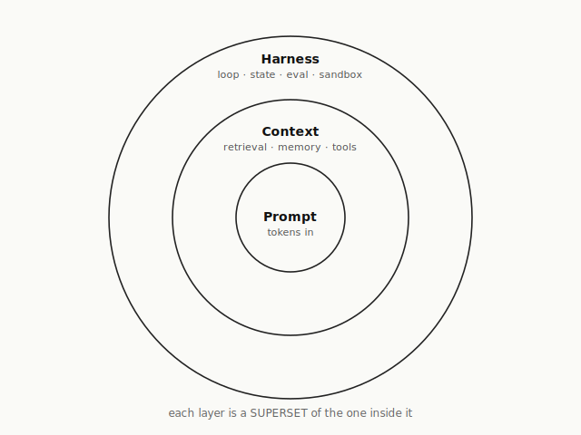

# 第 1 章 · 从 Prompt 到 Harness —— 一次视角的位移

> 如果你觉得你的 agent "最近有点蠢",**先别改 prompt**。
> 很可能你在错的尺度上解一个更大的问题。

## 一个半夜两点的故事

凌晨两点,一位工程师盯着屏幕上第四十轮的对话。agent 在两小时前已经想出了正确的解;他记得清清楚楚 —— 第十七轮,那个建议闪过一下,然后被下一个问题盖过去了。

他试着让 agent 回忆。

> "你刚才提过一个方案,用 OAuth2 device code flow 的。"
> "是的,您说得对。" agent 客气地接话,"我们可以采用 OAuth2 device code flow。" 然后它开始**从零**描述 OAuth2 是什么。

这位工程师那一刻没有修改 prompt 的想法。他关掉电脑,打开一个文本编辑器,写了一行字:**"问题不在这里。"**

这本书,就是从那一行字开始的。

## 三个名字,三把尺

你过去三年大概听过这三个词:

- 2023 年:**prompt engineering**
- 2025 年:**context engineering**
- 2026 年:**harness engineering**

最容易的误读,是把它们当成时髦词的更替 —— 去年流行 A,今年流行 B,明年流行 C,就像时装季。**这个读法会让你一辈子错过真正在发生的事**。

另一个误读是把它们当成三个竞争流派,逼自己站队 —— "我们团队是 context 派的"、"他们搞 harness 搞过了头"。这个读法会让你写一堆意识形态式的内部文档,但解决不了任何工程问题。

真正的读法是:**它们不是三个流派,是三把尺**。每一把测量的对象都比上一把大一圈。

- **Prompt 尺** 测**一次调用**的形状。你写给模型那 800 个字,它怎么组织、怎么措辞、怎么少样本。**Prompt engineering = 精修一次调用**。
- **Context 尺** 测**这一次调用能看到什么**。retrieval 给的片段、memory injection、tool descriptions、knowledge graph 切片。**Context engineering = 管理一次调用的视野**。
- **Harness 尺** 测**这个 agent 活着的全部行为**。跨多次调用、跨 session、跨 agent、跨时间。工具、状态、持久性、恢复、观测、评估、权限、人类 checkpoint。**Harness engineering = 管理一整条 agent 生命**。

三把尺嵌套。短尺量不了的东西,长尺能量;但长尺里**仍然有短尺**。一个 harness 工程师不会停止写 prompt —— 他每天都在写,只是 prompt 只是他工作的**一片叶子**,不是整棵树。

## 为什么那位工程师没改 prompt

回到凌晨两点。Agent 忘了第十七轮的方案 —— 这是 prompt 问题吗?

想象你改 prompt。你加一行:"请记住我们讨论过 OAuth2。" 下次 agent 确实"记得"了 —— 但它记得的是你**刚刚告诉它** 的那句话,不是第十七轮发生过的事实。你做的不是让 agent 拥有记忆,是**每次都重新告诉它它应该有记忆**。这件事扩展到一百个话题、一千次对话,你就是在全职给一个失忆症患者写备忘录。

这是 **prompt 尺** 能做的一切 —— 它只看一次调用。第十七轮的事实对一次调用而言,要么在 context 里(能看到),要么不在(看不见)。**它不会因为你措辞再好而自动进入**。

再想象你改 context。你搞一个 RAG 管线,把对话历史向量化,下一轮 agent 提问时把相关片段检索回来塞进 context。现在它"看起来"能回忆了。但你有没有注意到一件事?**retrieval 本身** 不是一次调用里的操作。什么时候检索、检索什么、怎么重排、检索不到怎么办 —— 这些决定都发生在**两次调用之间**,在 harness 层。**你已经越过 context 尺了,只是自己还没意识到**。

**这就是尺度错位的典型症状:你以为自己在第一把尺上工作,实际上你要解的问题只有在第三把尺上才有形式化的落点**。你在第一把尺上做再多,都只是在掩盖问题的真正位置。

## 三把尺,一个嵌套的同心圆

这张图不是比喻。它是**严格的集合包含关系**。Prompt 是一个点,context 是围着这个点的一个盘,harness 是围着这个盘的一个更大的盘。任何 context 问题都可以改写为"某次 prompt 调用看到的信息",任何 harness 问题都可以展开为"多次 prompt+context 调用之间的协调"—— 反之不成立。

这个不对称是这本书从头到尾的工程根据。它意味着:

- 一个号称"超越了 prompt engineering"的团队,**没有真的超越**。他们只是把 prompt 这一层外包给了别人写的框架。谁写的呢?LangChain、LangGraph、他们用的某个 agent SDK。他们仍然在用 prompt,只是不亲自写而已。
- 一个"我们只做 prompt,不搞那些花哨的"的团队,**做不了 agent**。Prompt 尺能做的最大的东西就是一次漂亮的完成,到此为止。
- 一个"我们已经做了 agent"的团队,只要工程上能长期跑下来,**事实上都在做 harness engineering**,不管他们叫它什么名字。Ariely 2013 年那句话,在这里以第一次的形式投下了阴影 —— 你以为大家都在做的事,真正做到的人比谁都少。

这三件事在同一张图里,是同一个结论的三个切面。

## 三个症状 —— 你在哪一把尺上

讲到这里,抽象层面已经说清楚。但读者最想问的往往是一件很务实的事:**我怎么知道我现在是在哪一把尺上?**

用三个场景自测。这不是测验,是**临床症状**。

**症状一**:你的 agent 第三十轮对话还记得第三轮说过的话吗?

如果不记得,这不是 prompt 问题 —— **再精修的 prompt 也装不下三十轮的事实**。它不是 context 问题 —— **再聪明的 retrieval 也要有东西可查**。它是**session 层** 的问题。你需要一个场外的、append-only 的事实流,在 agent 进程之外持续存在,**随时可以被新一次 prompt 调用按需加载**。这个场外存在,就是 harness 尺的第一层承诺。

Anthropic 在 2026 年 4 月给这个症状起了个名字:**context anxiety**。Agent 在感觉到 context window 快满的时候,会开始表现得像一个**被催赶着收尾的学生** —— 草草下结论、跳步骤、放弃本来能做的子目标。他们试过"更聪明的 summarization",失败;真正有效的修法是**硬重置 + 结构化移交**:把 agent 进程杀掉,起一个新的,通过 session 里的事实流告诉它"前面做过什么"。关键动作全部发生在 prompt 之外,在 harness 层。

**症状二**:你的 agent 执行完一次 tool call,**你** 知道它改变了什么吗?

注意问句的主语是"你",不是"agent"。agent 当然会说自己做了什么,但 agent 的自述不是证据 —— 如果它撒谎、记错、或只是措辞不精确,你怎么知道?你需要的是**独立于 agent 自述的观察**:每次 tool call 的 input 哈希、output 哈希、副作用清单、actor 归属、时间戳 —— 全部写进一条事件。这是**observability 层** 的问题,仍然不在 prompt 尺上。

上个月你们做事故复盘的时候,有没有一条事故的根因归到"agent 声称做过的事其实没做"?如果有,那次事故的修法,写进 prompt 里都解决不了。

**症状三**:今天你手上调通的一段 prompt + context,下周你的同事能**一键还原** 吗?

不是"能复述你的操作",是"一个命令让 agent 的起点和你此刻的起点完全一致"。这要求你们的 session、spec、tool 权限、模型版本、知识库状态都可以被**序列化、持久化、重放**。这是**state durability 层** 的问题 —— 和 prompt 尺之间隔着两层。

一个团队如果三个症状都答"做不到",它面对的不是"agent 不稳定"的问题,是**它一直在错的尺度上工作**。

## "模型变强了,不就不需要这些了?"

本章最难驳的一个诱惑是这个问题:既然模型每半年变强一轮,那我现在投入的 harness 是不是会在下一次模型升级时就变成负担?

答案需要分两半。

**一半是"会"**。Ch 3 会给出具体证据:从 Sonnet 4.5 升级到 Opus 4.6,Anthropic 的 harness 里大约 **40% 的代码被拆掉** —— 因为新模型不需要那些补丁。**赌模型不够好** 的那一半 harness 确实会变成负担。这是我们在这本书反复会强调的区分:**补模型缺陷**的代码是技术债,模型变强就要清算。

**另一半是"不会"**,而且这一半更重要。Session 协议、tool 权限边界、verification 独立性、spec 顶层 —— 这些是**协议层** 的投资,**不随模型能力波动**。Anthropic 讲 meta-harness 的时候反复强调:**只承诺接口长期稳定,不承诺任何具体实现**。接口是 Unix syscall 式的稳定,实现是可以每个模型换代都重写的。你押对了接口,你的工程每次模型升级都**更值钱**;你押错了层(押了具体实现、押了 prompt 技巧、押了某家框架),你的工程每次模型升级都要重来。

**"模型变强了我就不需要驾驭工程" 是一个范畴错误**。它把两层的事情搅在了一起。模型变强会让"补模型缺陷"的 harness 变薄,但会让"稳定接口上的 harness" 更有价值 —— 因为现在同一个稳定接口上,能跑更多、更复杂、更关键的 agent。

## 为什么这件事是"视角位移",不是"学新词"

从 prompt 尺走到 harness 尺,不是学一套"更高明的 prompt 技巧"。这是这本书第一个锋利的断言。

Fisher Zhang 在 *Harness Engineering: The Oldest New Idea in AI* 里给了一个比喻,这本书从这里开始反复借用:

- **Elden Ring** ≈ prompt 尺。每一次攻击、每一次闪避,玩家亲自按键。一对一,极致精雕。
- **Clash of Clans** ≈ context 尺。战前布阵决定一切;开打之后基本观战。
- **StarCraft II** ≈ harness 尺。指挥几百个自治单位,靠规则、优先级、阵形。**粒度变粗,责任变大**。

从 Elden Ring 到 StarCraft II,玩家不是变被动,是**在做一件根本不同的事**。Prompt 工程师对每次 inference 精雕细琢,满足感来自"这次对话漂亮";harness 工程师设计的是"让成千上万次 inference 在我不盯着的时候**仍然能行**" 的那套规则,满足感来自"这个系统半年没我也能跑"。

翻译到日常工作:

- Prompt 尺的一天,你数 diff 行数、数 prompt 效果提升几个点。
- Context 尺的一天,你数 retrieval 召回率、context 长度怎么压缩。
- Harness 尺的一天,你写的是 session schema、verification 协议、tool 权限矩阵、skill 晋升规则。**这些东西单看每一件都不像"AI 能力",但正是它们让你的 agent 系统在明天、下周、下个季度都以可预期的方式运行**。

从外面看,harness 工程师每天并不在"用 AI" 做什么。从里面看,他做的每件事都在决定 AI 能以什么方式被用。这种落差本身,就是本章要命名的那次"视角位移"。

## 这本书从这里开始

所以当你合上本章,希望带走的不是一条记忆 —— "prompt / context / harness 是三层"—— 而是一次**判断的升级**。

下次你看到一篇 AI 工程文章、听到一场 agent 团队汇报、开始一个新的内部技术讨论,第一件事不是记住谁用了什么框架,是问自己三个问题:

- 这件事,**能装进一次调用的边界** 里吗?能 → prompt 尺度。
- 不能,但**组织好一次调用的信息视野后** 能吗?能 → context 尺度。
- 都不行 —— 跨调用、跨时间、跨 agent、要求持久化 —— 这是 harness 尺度。

能不能答得准,是有差别的。**答不准,你在做的工程永远用错了力**。

第 2 章,会在这个坐标系里放下第一块基石:**面向意图**。那位凌晨两点的工程师后来关掉电脑之后,做的第一件事不是加班写代码 —— 是重新写了那个 feature 的 spec。第 2 章的主题就是这件事。

---

## 可观察信号(自测三问)

- 杀掉你的 agent 进程,**重启后它能从最后一个事件继续**吗?
- 一次 tool call 三天后出问题,你**还能追回是哪条输入导致的**吗?
- 上周你手上调通的那段 prompt,**今天在另一个同事手里能一键还原**吗?

任何一问回答"做不到",你撞上的不是 prompt 问题,是 harness 尺度的问题。

---

## 本章核心论断

1. Prompt / Context / Harness 是**三把嵌套的尺**,不是三个流派。**harness ⊃ context ⊃ prompt**,严格包含。
2. "超越了 prompt 工程"的团队,大多只是把 prompt 外包了。"只做 prompt 的团队"做不了 agent。**真做长期 agent 的人,不管叫什么名字,事实上都在做 harness engineering**。
3. 位移到 harness 的三个不可回避理由:**多调用状态 / 调用外动作 / 跨会话沉淀** —— 每一个都在 prompt 和 context 尺上没有形式化落点。
4. "模型变强了就不需要 harness"是范畴错误。**补模型缺陷的 harness 会变薄,稳定接口的 harness 会更值钱**。
5. 位移的本质不是"学新词",是**视角的升级** —— 从精雕一次调用,到设计规则让千万次调用自治。

---

## 本章奠基文对齐

- [[fowler-on-harness]] —— *Agent = Model + Harness* 等式的公开出处
- [[medium-oldest-new-idea]] —— 三段论 + 游戏尺度比喻的原论述
- [[neo4j-context-vs-prompt]] —— context 层立场的代表文本
- [[mindstudio-harness]] —— superset 论证的独立印证
- [[anthropic-harness-design]] —— "context anxiety" 命名、session ≠ context window 原句

## 本章对应 wiki 页

- [[concept-harness]] · [[concept-prompt-vs-context-vs-harness]] · [[ariely-big-data-quote]]

---

**第 1 章做完了一件事 —— 重新安置你的坐标系。** 坐标系有了,下一步是方法论第一性原理 —— **为什么代码是 AI 的输出,意图才是工程师的上游对象**。那位凌晨两点的工程师下一步做了什么?他重新写了那个 feature 的 spec。第 2 章从那个动作开始。
