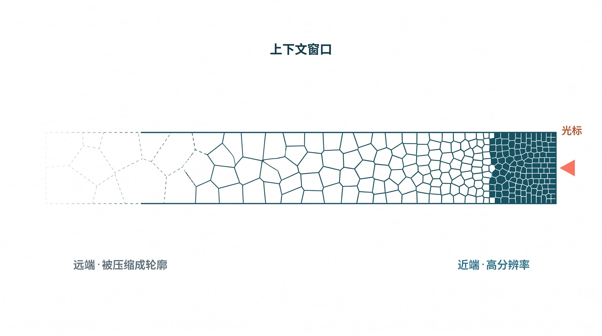
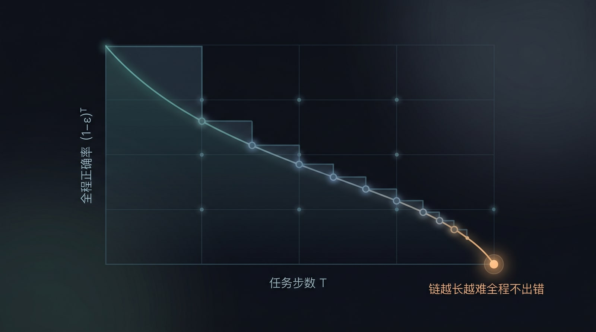
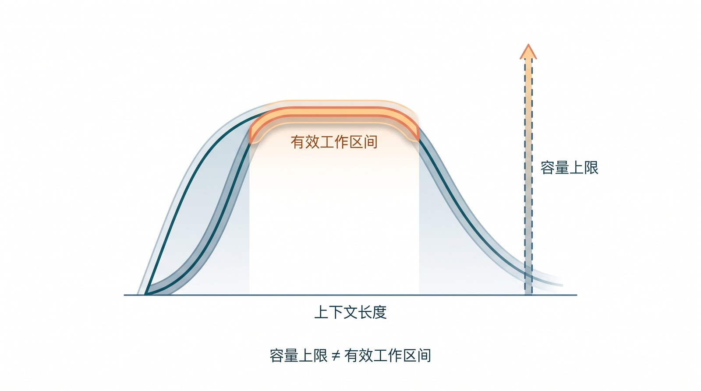
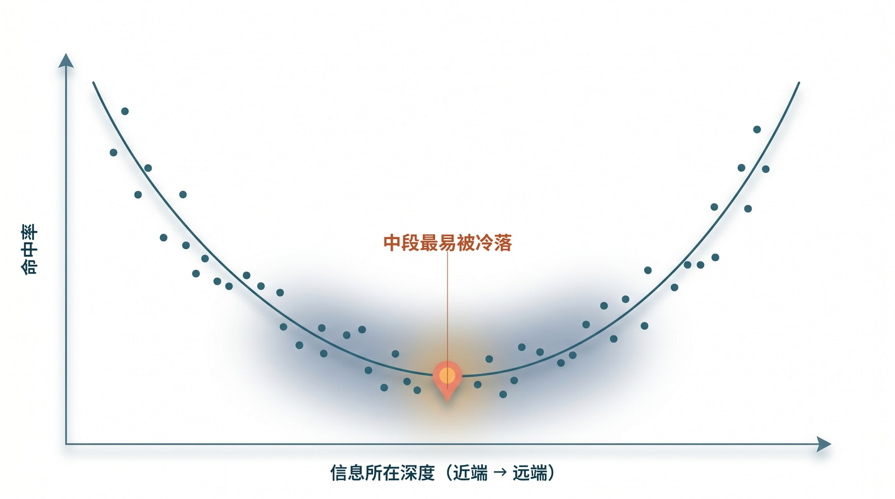

# 2. 时空失效：工作区间为什么必然存在

第 1 章末尾留下一个说法：LLM 有一段最擅长的“工作区间”，离开它，质量就开始飘。这一章要把这个说法钉死成一条结论——**有效工作区间的存在，是 transformer 加自回归这套架构在有限算力与显存预算下的数学必然，而不是“模型还不够好、以后会修好”的暂时缺陷。** 讲透机理很重要，因为后文每一项 harness 能力，都是对其中某一条失效机理的对症补偿；不先讲清楚模型天然缺什么，harness 就会被误读成一袋经验技巧。

> **如果你暂时不想啃公式，这一章其实只说五件事。** 把它们记牢，你就拿到了全章的地基；至于每条背后的数学推导、各家厂商的具体做法和论文出处，都是给想深究的人备的——第一遍读不动，尽管跳过，需要时再回来查。
>
> - **上下文窗口不是一块平坦的内存。** 同一句话，放在窗口的不同位置，模型用起来的难易并不一样。
> - **近处清楚、远处发虚。** 离当前光标越远的内容，越容易被“平均”掉、被压缩掉，有效分辨率从光标附近向外递减。
> - **窗口越满，检索越钝。** 塞进去的东西越多，单条关键信息能分到的注意力就越薄。
> - **任务越长，越容易跑偏。** 模型会把自己上一步可能犯的错，当成下一步必须遵从的事实，偏差被一路放大、供养。
> - **这些都不是“模型还不够好”，而是架构层面的数学必然。** 它不能靠“等下一代模型”解决，只能靠一个外层系统去补偿——这正是后文 harness（驾驭层）存在的全部理由。
>
> 下面就是这五条各自的“为什么”。读到公式、厂商缩写或论文引用卡住的地方，记住：那些只是佐证，跳过不影响你接着往下读。

## 2.1 一个统一视角：自回归是一个有限预算的时空滤波器

把第 1 章 §1.6 那两个硬件类比收束成一句话：**自回归加 attention，本质上就是一个有限预算下的时空滤波器。** 它对“位置远”（空间）和“时间旧”（时间）的信号都会衰减——就像一束光打在越来越宽的舞台上必然越来越暗，又像一段话经过越来越多人转述必然越来越走样。缓存讲的是空间维度上的工作集，放大器线性区讲的是不失真的稳定带宽，而 LLM 同时落在这两条约束之下。下面把“空间”和“时间”两条轴分开拆解。

## 2.2 空间轴：位置越远，有效敏感度越低

沿着上下文的方向，有好几条机理在同时压低远端词元的有效权重，它们叠加起来，才让“窗口不平坦”成为必然。它们的名字——softmax 稀释、RoPE 距离衰减、残差容量、过度挤压——一时记不住不要紧，要紧的是记住“它们叠加起来，让远端必然变糊”这个总效果；下面每条里的公式和论文引用都是佐证，第一遍可以略过，只追每段末尾那句加粗的小结。

最直接、也最接近纯算术的一条，是 softmax 带来的**稀释**。回忆第 1 章 §1.3：注意力的权重总和恒为 1——这意味着注意力是一种“守恒”的资源。打个比方，一位老师的目光总量是固定的一份：台下五个学生时，每张脸都照顾得到；台下五百人时，同一份目光摊到每个人身上，几乎落不下什么。模型也一样，窗口里有 `n` 个词元，平均每个只分到 `1/n`。要让模型把目光牢牢压在某一个远端关键词元上，它的 logit 就得显著高过其余——具体地，要把那个词元的权重抬到 \\(p\\)，它的 logit 需要比其余高出大约 \\(\ln[(n-1)\cdot p/(1-p)]\\)，也就是随 \\(n\\) 大致以 \\(\ln n\\) 的速度增长。可 logit 不能想多大就多大：它正比于 q、k 两个向量的点积，而现代模型为了训练稳定，会用 RMSNorm、QK-Norm，乃至 Kimi 报告里专门设计的 QK-Clip 把它压住——不压的话，attention logit 会冲到上千量级、训练直接发散。于是 logit 的可达差距被一个与 \\(n\\) 无关的常数 \\(G\\) 卡死，单个词元能拿到的最大权重大约是 \\(w_{\max} \approx e^{G}/(e^{G}+n-1)\\)，随 \\(n\\) 增大不可避免地趋于零。结论几乎是算术而非调参：**窗口越满，对任意单个远端证据的“最锐检索”就越弱。**[^softmax-dilution-ch2][^bounded-logit-ch2]

与这条稀释叠加在一起的，是位置编码本身带来的**距离衰减**。今天主流的位置编码叫 RoPE，它的做法是给每个位置的 q、k 旋转一个与“第几个词元”相关的角度，从而把位置信息编码进去。这种旋转有一个数学副作用：两个词元离得越远，它们 q、k 内积的上界就越低——也就是说，距离本身就在替模型“调暗”远端。更麻烦的是，一旦上下文长度超出训练时见过的范围，这些旋转角度会“退相干”，外推直接失效。需要诚实地补一句：这条距离衰减的严格证明假设了 q、k 是常向量，真实情况下它更像一个先验偏置而非铁律——但偏置的方向是确定的。[^rope-decay-ch2] **一句话：位置编码本身就在替模型把远处“调暗”——离得越远，远端能拿到的上界越低。**

再往深一层，是一个容量问题。还记得第 1 章 §1.2 说过，每个词元的残差流是**定宽**的吗？这条固定宽度的向量，要同时承载整段上下文里与当前词元相关的所有信息。由信息论，一个定宽的状态无法无损地保存无界的上下文——越旧、越远的细节，越会被后来的信息压缩、覆盖。这正是第 1 章 §1.7 那句“看起来记得、却没有持久事实”在数值层面的根：模型并没有真的把某条约束写进某个寄存器，只是在当前这薄薄一层表示里，暂时还留着它的影子。**一句话：定宽的残差流装不下无界的历史，越旧的细节越容易被后来的信息挤掉、覆盖。**

最后一条藏在“多层”这个结构里，业界借用图神经网络的术语叫它 `over-squashing`（过度挤压）。要把一个远端词元的信息送到“当前预测位点”，得跨越很多层注意力；而由于第 1 章 §1.3 讲的因果掩码——每个位置只能看它左边的词元，信息只能自左向右、层层向最后一个位置汇聚——逐层的 softmax 平均会把任何单一来源指数级地稀释掉，以致两段本来不同的长输入，会在最后一个位置的表示上坍缩成几乎一样（低精度浮点会让情况更糟）。这解释了一个反直觉的现象：在长上下文里，“计数、复制、精确区分”这类看起来最简单的任务，反而最先退化。[^oversquash-ch2] **一句话：远端信号要穿过太多层才能抵达终点，被逐层平均挤压殆尽——这正是长上下文里“数数、复制、精确区分”反而最先垮掉的原因。**

把这几条叠起来，§2.4 将给出的经验现象——U 形偏置、NoLiMa 等——就有了机理解释：**上下文窗口不是一块平坦内存，它的“有效分辨率”从光标附近向远处递减。**

而工业界已经把这条“非均匀分辨率”直接做进了架构——而且做法虽然名字各异，骨子里却是同一件事。为了在百万词元上还付得起算力（还记得第 1 章 §1.4 说键值缓存随长度线性涨吗），新一代模型干脆不再对全程做均匀的全注意力。值得把它们摆到一起对照：三类看似无关的工业技巧，其实都是同一个“近端高分辨率、远端粗化”的滤波器，区别只在于那个把远端调暗的“核”长什么形状。

最直白的一种是滑动窗口注意力，它的核就是一个字面意义上的矩形窗：窗内的词元一视同仁地全权重保留，窗沿之外一刀切到零，远端不是被调暗，而是被直接抹掉。第二种是线性注意力与状态空间模型（MiniMax 这一代的做法是典型），它的核是一条指数衰减曲线——没有硬边，越往前的词元权重越小，像旧账本上一天天褪色的墨迹，褪得平滑，却也褪得不可逆。第三种最隐蔽，是 KV 压缩，本质是对历史做一次有损降采样：近端最近的词元保留高分辨率、原样不动，越往远端、KV 被聚合得越狠。DeepSeek V4 的 CSA 把每 \\(m\\) 个词元压成一条、HCA 再把每 \\(m'\\)（远大于 \\(m\\)）个词元压成一条，Kimi 的 MLA 则是把多头的 KV 投影到一个低秩潜空间里再展开——名目不同，效果一致：远端词元不再各自占一格，而是几个、几十个挤进同一条被平均过的表示里，细节在降采样中永久丢失。把这三种核叠加看，矩形、指数、阶梯状的压缩比，无非是同一族“近清远糊”包络的三种参数化罢了。

这件事的推论很有分量，值得说重一点：**连最有动机把“窗口能开多大”当卖点的厂商，自己都在用压缩偷偷换取那个标称的容量上限。** 一家公司在规格表上写下“1M context”，却在架构里用 CSA/HCA 把远端 KV 成倍地砍掉——这本身就是一句无声的供认：那一百万格不可能处处等价，否则它根本不必、也不敢压。换句话说，**所谓“1M context”从来不是一条处处等价的传送带，而是一组分辨率非均匀的滤波器：近端清晰，远端只剩轮廓。** 这恰恰从厂商自己的设计选择里，反证了本章那条主线——容量上限不等于有效工作区间。

也正因为远端是被这样一层层粗化掉的，§2.5 那套探针在你自己的模型上量出来才会是那个样子：当你把“针”往远端（`depth → 0%`）挪、再一路把总长 `L` 推大，你看到的 `recall–depth` 曲线远端塌陷，并不是模型“偶尔走神”，而是你正隔着这层非均匀滤波器去够一条早已被矩形窗截断、被指数核压暗、或被 CSA/HCA 平均进邻居里的证据——能量本就不够，曲线自然抬不起来。能不能直接读到某个模型用了哪种核，往往藏在闭源细节里；但探针给你的远端塌陷形状，是这层滤波器留在外部可观测面上的指纹，量一次就看得见。[^nonuniform-kv-ch2]

这里要专门强调一句，免得读者误以为“换个更强的闭源前沿模型就没事了”：**闭源前沿也不例外。** 第三方的系统评测（如 Chroma 对 18 个前沿模型做的 *Context Rot* 测试）显示，每一个模型都在每一个长度增量上掉点；前沿模型只是衰减得更缓，而非豁免。更说明问题的是，lost-in-the-middle 和干扰项导致的退化，在大概率使用全注意力的模型上照样出现——这说明它来自上面那几条基本面的“地板”，而不只是压缩作弊。Anthropic 自己的工程文档也直说，context rot 在远未触达容量上限时就已经开始。这是个该让团队清醒的事实：你买到的从来不是一块平坦的百万格内存，而是一段中心清晰、边缘发虚的视野。[^context-rot-ch2]



*图：所谓“1M 上下文”不是一条处处等价的传送带。靠近光标的右端分辨率高、清晰可辨；越往远端越被压缩、聚合，最终只剩一道模糊轮廓——容量上限之内，有效分辨率从光标附近向远处递减。*

## 2.3 时间轴：时间越旧，有效敏感度越低

长任务的失效看起来是个“时间”问题——跑得越久越偏——但要拆成两半才讲得透：一半可以归约成空间问题，另一半不可约。

先说可约的那一半，姑且叫它**记忆老化**。第 1 章 §1.4 交代过，模型对“过去”的唯一留存就是键值缓存，除此之外并没有别的跨步状态——所以“k 步之前的事还记不记得”，等价于“那个词元还在不在窗口里、当前词元还 attend 得到它吗”。随着生成一步步推进，一个旧事实与当前光标之间的相对距离单调增大，于是它就按上一节的几条空间机理被衰减，最终被窗口截断、被压缩、或被逐出。所以“随时间遗忘”在机理上就是“随相对距离衰减”——时间问题塌缩成了空间问题。开篇那个“忘掉两小时前约束”的 agent，并不是记性差，而是那条约束在它的视野里一步步退到了边缘。

再说不可约的那一半，叫**误差复合**。还记得第 1 章 §1.5 说自回归是一个“把自己输出回灌进自己输入”的反馈回路吗？即便给它一个完美、无限、均匀的窗口（空间衰减为零），这条回路仍然会让它随任务变长而劣化。这一点最像小孩玩的传话游戏：第一个人说得清清楚楚，传到第十个人嘴里已经面目全非。区别只在于，自回归模型既是传话的人、也是听话的人——它把自己上一句可能说错的话，当成下一句必须遵从的事实。设每一步出错的概率是 \\(\varepsilon\\)，那么连续 \\(T\\) 步全对的概率大约是 \\((1-\varepsilon)^{T}\\)——可靠性随任务长度（horizon）几何式地衰减。再叠加一个被称作 exposure bias 的偏差：训练时模型总是被喂以正确的前缀，推理时却只能以自己越来越偏离分布的输出为条件。换句话说，错误不是被稀释，而是被供养。这一半是反馈回路自身的性质，**延长上下文救不了它**——只能靠降低单步 \\(\varepsilon\\)、缩短 horizon、引入独立验证、或重采样。



*图：误差复合。即便给一个完美无衰减的窗口，自回归也会把上一步可能的错误当成下一步的既成事实，于是“连续 T 步全对”的概率随任务长度 T 几何式下滑——链越长越难全程不出错，这一半延长上下文也救不了。*

用电路语言收个尾会很干净：一个带反馈的递归系统，有两种相互独立的退化方式——一种是它的“冲激响应”随距离衰减（对应记忆与空间衰减，可约），另一种是它把自己带噪的输出回灌后，噪声在回路里不断累积（对应误差复合，不可约）。对应的补偿，恰好也是两类互补的器件：一类像“锁存器”，把关键事实牢牢锁住、对抗记忆衰减；另一类像“负反馈环”，把错误送回去纠偏、对抗误差复合。这两类器件的电路史——Black 的负反馈放大器、SRAM 的双稳态锁存——会在第 3 章作为 harness 的血统展开；本章先把“为什么必然需要这两类器件”从机理上立住。

这里顺手给出一个后文会反复用到的可操作判据：**把丢失的信息重新塞回光标附近——如果失效被修复了，它就是空间问题，可由上下文工程补偿；如果模型本来就拿到了信息却仍然漂移、越错越多，它就是不可约的时间核，只能靠验证、缩短 horizon 和人在环上来兜住。** 记住这条分界线，后文几乎所有 harness 设计的取舍，都能落到它的两侧。

## 2.4 容量上限不等于有效工作区间：实测印证

上面的机理预测了一个直接后果：同一个上下文窗口，越往远端越不可用。这一节把它落到事实，并给出工程上该怎样对待它。



*图：容量上限 ≠ 有效工作区间。横轴是上下文长度，最右那条虚线是模型标称的容量上限；可“还能稳定检索、遵循指令”的有效工作区间（中间那段高原）远在它左侧就已回落。最大 context 是规格，最佳工作区间才是设计目标。*

2024 年初有过一个短暂的乐观时刻。Google 发布 Gemini 1.5，宣布它能在百万词元的“大海”里，以 99% 的命中率捞出那一根“针”——不少人当时以为长上下文问题就此了结。乐观没能维持多久，因为人们很快意识到，真实任务里要捞的从来不是一根针，而是一把散落各处、还彼此牵连的针。

把这件事摊开看，结论相当一致。Google 自己后续的 long context 开发文档就明确提醒：一旦从“单根针”变成多个待检索的信息点，命中率不再维持那个漂亮的数字，而且会随上下文内容大幅波动。[^gemini15-ch2][^google-long-context-ch2] 学术界给出的信号更直接：*Lost in the Middle* 发现，放在开头或结尾的信息更容易被用上，夹在中间的则明显被冷落；*Found in the Middle* 进一步把这种现象概括成一条 `"U 形注意力偏置"`——这正是上一节那条“有效分辨率从光标附近向远处递减”的曲线，在检索任务上显出的形状。说到底，这是个很有人性的毛病：我们读一篇长文，也总是记得开头和结尾，把中间那段忘得最干净。[^ltm-ch2][^fitm-ch2] 而当任务从“按字面找”升级成“跨段落推理”时，分数会塌得更厉害——NoLiMa 去掉字面匹配线索后，单是在 32K 长度上，就把 GPT-4o 从 99.3% 打到了 69.7%；LongCodeBench 把场景换成真实的代码理解与修复，长上下文能力同样明显变脆。[^nolima-ch2][^longcodebench-ch2] 反过来，也正因为窗口不平坦，Anthropic 的长上下文文档才会给出那个很务实的经验：把长文档放在前面、把问题放在最后，复杂的多文档输入下，回答质量能提升三成左右。[^anthropic-long-ch2]

这些结果合起来说明同一件事：在同一个“1M context”里，不同位置、不同信息密度、不同任务形式的可用性并不均匀。上下文窗口更像一块可寻址的大内存，而不是一条任何位置都等价的理想传送带；所谓“最佳工作区间”，也不是某个固定的魔法数字（比如“128K 最好、256K 开始变差”），而是一条随任务结构变化的工作带宽——在多大范围内，模型还能稳定检索、遵循指令、保持多步推理、避免位置偏置，并让系统在成本和时延上可接受。

## 2.5 动手把窗口的不平坦量出来

前面几节的机理，和别人测出的那些曲线，都还停在“读到”。要把它变成你自己的工程直觉，最划算的办法是花半天，在你真正要用的那个模型上，把窗口的不平坦亲手量一遍。下面这套探针小到一个下午能搭完，却能逼出三条对设计直接有用的读数。

基本探针就是经典的“大海捞针”。造一段无关的长填充文本当“海”，在其中某个相对深度 `d` 处（`d=0%` 最靠开头、`d=100%` 最贴近问题）埋一句可验证的事实当“针”，把问题放在整段的最后，再看模型答不答得出那句事实。固定总长 `L`，让 `d` 从 0% 扫到 100%，每个 `d` 重复 `k` 次取命中率，画出来就是一条 `recall–depth` 曲线——它就是 §2.2 那句“有效分辨率从光标附近向远处递减”在你这台模型上的样子。



*图：把“针”埋在不同深度、扫描命中率，画出来往往是这样一条 U 形曲线——开头和结尾的信息容易被用上，夹在中间的最容易被冷落。这正是窗口不平坦在检索任务上显出的形状。*

```python
def probe(model, L, depth, distractors=0, paraphrase=False):
    needle = make_needle(paraphrase)        # 一句可验证的事实
    ctx = build_filler(L)                   # 无关长文本，总长约 L 个 token
    ctx = insert_at(ctx, needle, depth)     # 在相对深度 depth 处插入针
    for _ in range(distractors):            # 可选：埋几条相似但错误的“近似针”
        ctx = insert_at(ctx, near_miss(needle), rand_depth())
    q = question_for(needle, paraphrase)    # 问题放最后
    return verify(model(ctx + "\n\n" + q), needle)   # 命中=1 / 未命中=0

for L in [4_000, 16_000, 64_000, 256_000]:           # 扫长度
    curve = {d: mean(probe(model, L, d) for _ in range(k))
             for d in [0.0, 0.1, 0.2, 0.3, 0.4, 0.5, 0.6, 0.7, 0.8, 0.9, 1.0]}
```

真正有意思的是那三个旋钮，每拧一个，都在单独点亮 §2.2 的一条机理。拧总长 `L`（从 4K 一路到 256K），你会看到整条曲线随 `L` 增大而**整体下沉**——这正是 softmax 稀释：窗口里词元越多，单个远端证据能拿到的最大权重 \\(w_{\max}\\) 越往零走。往别处埋几条“近似针”（相似但错误的干扰句），你会看到曲线的**中段塌得更狠**——这是 U 形偏置叠加 over-squashing：夹在中间、又被相似信息包围的证据，最难被锐利地挑出来。再把针和问题都改成语义匹配、抹掉字面线索（paraphrase），你会看到整条线**再掉一截**——这就是 NoLiMa 那条“从按字面找，升级成跨语义推理找”时的额外退化。三件事几乎一定会发生，而每一件都不是“模型今天状态不好”，是架构机理在你的模型上的具体读数。

量到了曲线，接下来才是它真正值钱的地方——把读数翻译成设计决定。第一条最直接：找到那个“中段命中率还压得住可接受线”的最大 `L`，它就是这个模型在这类任务上的**有效工作区间上界**，该写进你的调度与切片策略，而不是去信规格表上那个容量上限。第二条用上 §2.3 那把判据：如果把针挪到光标附近（`depth → 100%`）命中率就回来了，那这就是个**空间问题**，可以靠上下文工程补偿——短而密的近端证据、检索、分层缓存，把关键事实搬回光标边。第三条是反过来的坏消息：如果针就摆在眼前、命中率却还是上不去，或者答案越长越跑偏，那你撞上的是**不可约的时间核**，再怎么搬运证据都没用，只能靠缩短 horizon、引入独立验证、把人留在环上来兜。

得诚实补一句分寸：这套探针给你的是**相对形状**和**你自己模型的工作带**，不是论文级的绝对分数；真要做横向对标，前面引到的 NoLiMa、*Lost in the Middle*、*Context Rot* 才是系统评测。可工程上你最需要的，恰恰不是“某模型在某榜单上多少分”，而是“我这个模型、这类任务、这个长度”的那条线——而这条线，只能你自己量。量过一次，“窗口不平坦”就从一句读来的信念，变成了手边一张能拿来拍板的曲线：后面每一次“这段材料到底要不要塞进提示词”的取舍，都有据可依。

## 2.6 小结：把容量上限和有效工作区间分开

因此，工程上必须把两件事分开：一件是**容量上限**，即模型最多能接收多少词元；另一件是**有效工作区间**，即在当前任务形态下，模型还能稳定检索、遵循指令、维持推理链的那一段上下文。前者写在产品规格里，后者才是 harness 真正要经营的对象。结论也随之而来：最大 context 是容量上限，最佳工作区间才是设计目标。一个 agent 系统不该默认“把更多材料塞进窗口”就会更可靠，而应当反过来设计任务——让模型每次只看到更短、更密、更靠近当前决策的证据切片，把状态、历史、产物和验证证据移到运行时的事实流里，再按需调回提示词。这条原则听起来朴素，却和大多数人对“长上下文”的第一直觉正好相反，它是本书后面所有上下文设计的出发点。

到这里，问题已经摆清楚了：模型在空间和时间上都会失效，而且这是架构层面的必然。下一章回答的，就是该拿它怎么办——那个把模型拉回工作区间的“外层控制系统”，到底是什么、从哪来。

[^softmax-dilution-ch2]: Petar Veličković et al., *Softmax is not Enough (for Sharp Size Generalisation).* 本章在此处使用其关于 softmax 随规模稀释、无法保持锐利选择的结论，来解释注意力质量守恒下的远端稀释；对应第 23 章参考文献 43。
[^bounded-logit-ch2]: 本章在此处使用 Kimi K2 技术报告关于 attention logit explosion 与 QK-Clip 的描述（不封顶时 max logit 越过 1000 量级、训练发散），用来说明 logit 被主动限幅、因此单词元注意力权重存在与 n 无关的上界；对应第 23 章参考文献 47。
[^rope-decay-ch2]: Jianlin Su et al., *RoFormer: Enhanced Transformer with Rotary Position Embedding.* 本章在此处使用其关于相对距离衰减包络（经 Abel 变换得到）的结论；并按 *Round and Round We Go!* 标注该衰减证明依赖 query/key 为常向量的前提，故宜视为先验偏置；对应第 23 章参考文献 44、45。
[^oversquash-ch2]: Federico Barbero et al., *Transformers need glasses! Information over-squashing in language tasks.* 本章在此处使用其关于 representational collapse 与因果掩码下信息单向汇聚、over-squashing 的分析，来解释长输入中计数/复制/区分类任务的退化；对应第 23 章参考文献 46。
[^nonuniform-kv-ch2]: 本章在此处综合 DeepSeek-V4 技术报告（CSA/HCA 混合压缩注意力、异构与 on-disk 键值缓存，将近端高分辨率与远端激进聚合并置）与 MiniMax M3（MSA 稀疏/线性注意力）的做法，用来说明工业界以非均匀分辨率换取百万级容量上限；对应第 23 章参考文献 48、49。
[^context-rot-ch2]: 本章在此处综合 Chroma *Context Rot* 对 18 个前沿模型在各长度增量普遍退化的测试，以及 Anthropic *Effective context engineering for AI agents* 关于“context rot 在远未触达容量上限时即开始”的说明，用来支撑“闭源前沿也不例外”；对应第 23 章参考文献 50、51。
[^gemini15-ch2]: Google, *Introducing Gemini 1.5, Google's next-generation AI model.* 本章在此处使用其关于 NIAH 命中率、1M context pricing tier 与时延预期的表述；对应第 23 章参考文献 14。
[^google-long-context-ch2]: Google AI for Developers, *Long context.* 本章在此处使用其关于 performance variability、retrieval-cost tradeoff 与 caching 的说明；对应第 23 章参考文献 15。
[^ltm-ch2]: Nelson F. Liu et al., *Lost in the Middle: How Language Models Use Long Contexts.* 本章在此处使用其关于长上下文位置偏置与中段退化的结果；对应第 23 章参考文献 11。
[^fitm-ch2]: Cheng-Yu Hsieh et al., *Found in the Middle: Calibrating Positional Attention Bias Improves Long Context Utilization.* 本章在此处使用其关于 `"U-shaped attention bias"` 的分析；对应第 23 章参考文献 12。
[^nolima-ch2]: Ali Modarressi et al., *NoLiMa: Long-Context Evaluation Beyond Literal Matching.* 本章在此处使用其关于 32K 条件下模型退化统计，以及 GPT-4o 从 99.3% 降至 69.7% 的结果；对应第 23 章参考文献 16。
[^longcodebench-ch2]: Stefano Rando et al., *LongCodeBench: Evaluating Coding LLMs at 1M Context Windows.* 本章在此处使用其关于代码任务长上下文退化的样例数据；对应第 23 章参考文献 17。
[^anthropic-long-ch2]: Anthropic, *Prompting best practices: Long context prompting.* 本章在此处使用其关于长文档前置、query 后置与约 30% 质量提升的建议；对应第 23 章参考文献 13。
