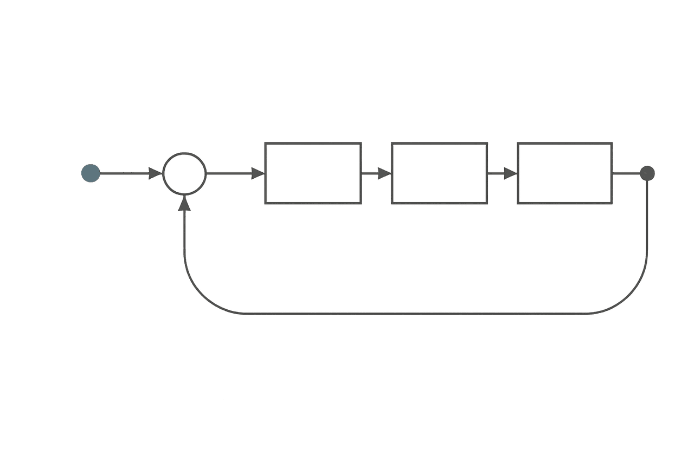

# 3. 控制系统的回应：harness 是什么、从哪来

第 1 章说清了 LLM 是一台什么机器，第 2 章说清了它在时间和空间上为什么必然失效。两章合起来，指向同一个工程结论：一个概率性的条件生成器，必须被一个外层系统持续纠偏，才能在长任务里留在有效工作区间内。这一章回答的就是——这个外层系统是什么、从哪来。

要先把主从关系说明白：**harness 的正当性首先来自第 2 章的失效机理；这一章要讲的控制论、缓存与负反馈历史，是这套控制语言的来源与直觉，而不是另一条独立的证明。** 答案会落到 agentic AI 上：所谓 agentic AI，不是“让模型自己想办法”的浪漫说法，而是给 LLM 搭一个能感知、行动、记忆、验证、恢复、并被人类监督的工作环境；正是这个环境提供的负反馈循环，才是 LLM 能稳定、高效工作的前提。

## 3.1 条件生成器带来的五类系统挑战

第 1 章末尾说过，LLM 是个高能力的条件生成器，而不是状态机。把这样一台机器放进真实工作流后，问题很快就不再是“它能不能回答”，而是几件它天生不擅长的事接连冒出来。最先暴露的是目标保持：用户目标会被拆成一串带依赖、带冲突、带优先级的子目标，模型能把目标复述得很漂亮，却不天然拥有跨小时、跨会话守住目标的机制。紧接着是上下文选择——真实任务的材料远大于窗口，哪些内容常驻、哪些按需加载、哪些压缩成摘要、哪些必须写回事实流，这种取舍不能指望模型临场自觉。再往下是工具副作用：shell、文件系统、浏览器、MCP、外部 API 都会真实地改变环境，而“模型提出一个动作”绝不等于“这个动作就该被执行”。然后是结果验证：生成器天然偏好给出连贯的结论，可连贯并不等于正确，产物到底存不存在、新不新鲜、属不属于当前任务、满不满足业务约束，需要一个独立的判断者。最后是人类控制——用户需要授权、打断、恢复、审计和接管，一个看不懂、停不下、复不了盘的 agent，哪怕短期能把活干完，也很难真正进入生产。

这几类挑战，没有一类是单个 prompt 能彻底解决的。prompt 能提高局部的成功率，却提供不了持久状态、权限边界、工具隔离、回放证据和终态裁决——它们必须进入运行时。

## 3.2 Agent 概念的演化：从自治系统到 LLM 工具执行体

早期的 agent 理论并不是从 LLM 开始的。Franklin 和 Graesser 给 autonomous agent 下的定义，今天拿来当起点依然合适：agent 不是一次性运行的程序，而是会 `"senses that environment and acts on it, over time"` 的系统；他们甚至故意举了个有点刺耳的例子，说一个恒温器也满足这个定义。[^agent-theory-ch3]

这句话初听很“降格”，因为现代人一提 agent，脑子里先冒出来的往往是个会说话、会规划、会调工具的复杂体。但 Franklin / Graesser 的用意恰恰相反：他们想提醒我们，别把 agent 的本体误认成它语言的表面。只要一个系统会感知环境、按当前状态调整行为、再把自己的行动回写进下一轮的感知条件里，它就已经进入了 agent 的问题域。Wooldridge / Jennings 那条经典线索，进一步把 agent 的弱定义压成几项可工程化的特征：自主性、反应性、主动性和社会性。[^agent-theory-ch3] 到了 LLM 时代，ReAct 把这条线索重新接到语言模型上——模型不再只做一次性回答，而是在推理（reasoning）和行动（acting）之间来回循环，让每一步的观察结果都进入下一步的推理；Claude Code 论文也把现代 coding agent 的演化路径讲得很清楚：从自动补全，到 IDE 助手，再到能规划多步修改、执行 shell、读写文件、迭代自己输出的 agentic system。[^llm-agent-evolution-ch3][^claude-code-design-space-ch3]

把这些概念翻成工程语言，一个现代 LLM agent 至少包含下面这个循环：

```text
用户目标 / 环境 / 工具 / 运行时事实
  -> 感知（读取上下文、工具回执、session 状态）
  -> 判断（识别约束、估计状态、更新计划）
  -> 决策（选择下一步、选择工具、选择角色/路径）
  -> 行动（调用工具、修改产物、派工、回写事实）
  -> 新环境 / 新事实
```

这也正是 agent 和普通聊天程序在工程上完全不是一回事的原因。普通程序的输入输出常常是一锤子买卖；而 agent 当下的行动，会改变它下一次能感知到什么，所以它天然是个闭环系统，而不是一个单轮映射函数。语言模型在这里只是判断器、或者说策略生成器的一部分，而不是整个系统。

## 3.3 Agentic AI 做的事：给 LLM 建一个稳定工作环境

如果把上一节那个闭环拆开，agentic AI 在做的事就清楚了：它不是替代 LLM，而是为 LLM 建一个工作环境。这个环境大体分工如下——感知的部分，负责把用户目标、文件、日志、网页、MCP 资源、历史事实和工具回执，组织成当前可用的上下文；行动的部分，负责把模型提出的动作，转成受权限、沙箱、schema 和并发规则约束的工具调用；记忆的部分，负责把重要事实写回 session、文档、skills、memory 和 artifact，而不是任由它们只漂在 prompt 里；验证的部分，负责把“看起来完成”改成“证据证明完成”；而控制的部分，则负责压缩、恢复、打断、升级、分派子 agent，并把错误反馈回下一轮。

Claude Code 论文对这一点的概括很有价值：核心的 agent loop 可以简单到只是一个“调用模型、运行工具、再来一遍”的 while 循环，但绝大多数代码并不在这个循环里，而在循环周围那套系统——权限、compaction、MCP/插件/skills/hooks、子 agent 派发，以及追加式的 session 存储。[^claude-code-design-space-ch3] 这恰好说明，agentic AI 的本体不是“模型多聪明”，而是模型周围那套让它能持续工作的控制系统。所以本书所说的 harness，不该被理解成一层外挂的脚手架，而应被理解成 agent 的外层反馈控制系统：它的任务不是让模型显得更聪明，而是持续感知偏差、校正偏差，并把系统重新拉回可用区间。

## 3.4 三段血统：控制论、缓存、负反馈

这套控制系统并不是凭空发明的。今天我们在 agent 上遇到的问题，本来就是三段老工程史在一种新的计算介质里重演——它们正是第 1 章 §1.6 那两个类比（缓存、放大器）的来处。隔着半个多世纪，这三拨人面对的其实是同一个问题：怎样让一个系统，在噪声里不丢方向。

第一段是**控制论**。Norbert Wiener 之所以重要，不只是因为他写了一本标题里带 `Cybernetics` 的书，更因为他把一个工程问题第一次讲成了一种统一的语言。Britannica 对这段历史的概括点到了要害：Wiener 在二战期间处理的是“如何瞄准移动目标”这类控制问题，他在预测、滤波和目标保持上的思考，后来直接通向了控制论。[^cybernetics-history-ch3] 他关心的不是“机器会不会像人一样思考”，而是“一个系统怎样在持续变化的环境里保持方向”——这是个相当谦卑的问题意识：不追问机器能否超越人，只追问它能否别在半路走丢。MIT Press 对《控制论》的概括很简洁：它研究的是带有 `"feedback loops"` 的系统中信息如何被控制，以及噪声如何破坏系统的 `homeostasis`（稳态）。[^cybernetics-foundation-ch3] 把这套语言翻回今天的 LLM agent，结论非常直接：真正困难的问题，不是让模型偶尔答出一个漂亮答案，而是让系统在任务持续推进、外界不断反馈、约束持续变化时，仍然不丢目标——而控制论关心的“目标保持”，恰好就是第 2 章 §2.3 那条“记忆老化”机理在系统层面显出的样子。

第二段是**缓存**。第 1 章 §1.6 已经讲过缓存层级和局部性，这里补的是它背后那段很“物理”的失败史，因为它和 agent 的上下文控制几乎同构。Computer History Museum 的描述很形象：第一代很多内存是串行的，比特在环路里循环流动，机器想读写某个数据，只能等那一串比特转回到可访问的位置；Maurice Wilkes 的 EDSAC 用过水银延迟线，数据化作声波脉冲在水银柱里来回，你要的那一位得等它转回管口；直到随机访问内存出现，才真正 `"eliminated the wait"`。[^cache-history-ch3] 后来分层越来越清楚：IBM 的 System/370 把计算带进“硅时代”，而它所用的双极型 RAM 正是用作缓存。这段演进说明，缓存不是“聪明人爱抽象”的产物，而是当单层存储无法同时满足速度、容量和成本时，被现实逼出来的体系结构选择——这恰好也是今天“1M 上下文 vs 有效工作区间”那道矛盾的前身。Chris Terman 把缓存奏效的前提总结成一个词——`"locality of reference"`（引用局部性）：系统不必把全部数据都放进最快层，只需把当前工作集放进去，再靠组相联度、块大小、替换策略、写策略自动管理层间流动。[^memory-hierarchy-ch3] 这套逻辑直接对应到 agent：当前这一轮的 prompt 相当于贴近 CPU 的 L1，`AGENTS.md`、skills 和短期 memory 相当于可快速调入的次级层，而 session 事实流、artifact、文档、外部检索结果相当于更慢更大的下层存储。harness 在这里做的，就是一种“认知层级的缓存控制”——决定什么允许进入当前 prompt（admission）、什么旧信息该退回 session（eviction）、一次喂进去的是整块原文还是压缩切片（block size）、哪些中间状态必须立刻写回持久事实流（write policy）。这正是第 2 章 §2.2 那条“softmax 稀释”机理的直接对策：不把高速层塞爆，只把短、密、近的证据切片放进当前窗口。

第三段是**负反馈**，故事感最强。Harold S. Black 在 Bell System 遇到的问题并不神秘：长途电话链路上，信号要穿过一串又一串放大器，增益是有了，可失真、噪声和漂移也一路叠加上去——这几乎就是第 2 章 §2.3 那个“传话游戏”的电学版本。Black 为消除失真坚持了六年，最终在一个再普通不过的通勤早晨、在开往曼哈顿的渡轮上想清楚了负反馈放大器的原理，顺手把推导记在了一份报纸的边角上。[^feedback-history-ch3] 这件事揭示了一个反直觉的工程事实：成熟系统追求的，往往不是最大的裸增益，而是更可控的整体行为。回到第 1 章 §1.6 那个放大器——它只在线性区内不失真，越界就削顶；Black 的做法，本质上是把一部分输出送回输入端，用主动牺牲一点增益，换来更宽的线性区、更低的失真和更可预测的整体表现。[^feedback-circuits-ch3] 半导体世界里还有一幅互补的画面：Terman 讲 SRAM 的存储单元时说得很直接，它本质上是一个 `"positive feedback loop"`（正反馈回路），用来形成可稳定保存状态的双稳态。[^memory-hierarchy-ch3] 这正是第 2 章 §2.3 点到的那两类互补反馈的电路原型——正反馈用来锁存状态，让一个比特不至于自己滑掉；负反馈用来抑制放大链里的漂移与失真，让整体仍停在稳定区。对一个长期运行的 agent，这两类机制缺一不可：它的“锁存器”，是 session 事实流、通过了验证的 artifact，以及角色、作用域、worktree 这些边界；它的“负反馈环”，是验证器、回放、dashboard、人工升级、角色重分配和恢复逻辑。长任务 agent 最容易犯的错，恰恰是把这两类机制一起省掉——既没有东西把关键事实锁住，又没有东西把错误输出送回纠偏，结果短期看跑得飞快，长期看状态漂移、工具误用、上下文污染和错误自信一起累积，败因和那条没有负反馈的放大链一模一样。

把这三段血统收束到一起，会得到一套可以直接套用的闭环控制词汇——而这套词汇，正是后面所有章节在反复使用、却很少被一次性讲清的那套。控制工程里，一个闭环系统总有这么几样东西：一个**参考值（setpoint）**，是你希望系统稳定停在的目标；一个**误差信号（error）**，是当前状态与参考值之间的差；一个**传感器**，负责把当前状态测出来；一个**控制器**，负责根据误差算出该怎么调；一个**执行器**，负责把控制器的决定作用回系统上；以及一类**扰动（disturbance）**，是不断把系统推离目标的外部噪声。还有一个常被忽略的角色叫**前馈（feedforward）**——它不等误差出现，而是预先根据已知信息把动作调对，好减少之后要纠的偏差。家用恒温器就是最朴素的样本：参考值是你设的温度，传感器是温度计，控制器是那块判断逻辑，执行器是加热或制冷，扰动是开窗灌进来的冷风。

把这套词汇一对一地钉到 harness 上，agent 这个闭环就彻底显形了。**参考值**是用户目标加验收标准——这本书反复强调要把它锁进 session、别让它漂在 prompt 里，正是因为参考值一旦丢，整个回路就失去了“对齐谁”的依据。**传感器**是工具回执、文件变化、validator 结果、子 agent 摘要和那条事实流——第 8 章之所以死守“前端只能投影、不能发明事实”，本质上就是在保护这枚离人最近的传感器不撒谎。**误差信号**是验证结果与目标之间的差：验证器报一个 `failed`，就是这个回路测到了一次非零误差。**控制器**是 harness 的调度循环——它读误差，决定继续、压缩、重试、派工、升级还是打断。**执行器**是 shell、文件系统、MCP、子 agent 这些真正改变环境的手。而**扰动**，恰恰就是第 2 章那几条失效机理：上下文衰减、记忆老化、误差复合，外加外部世界的网络抖动和工具失败——它们无时无刻不在把 agent 推离参考值。至于**前馈**，对应的正是 `AGENTS.md`、角色指令、skills 这类“在行动之前就提高成功率”的向导，也就是下一节 Böckeler 那个“guides 在前、sensors 在后”的分工。看清这张对应表，本书后面那句反复出现的“harness 是外层反馈控制器”，就不再是一句借来的比喻，而是一份可以逐个元件去核对的工程清单：哪一项缺了，回路就会在那一处失稳——没有参考值锁存就目标漂移，没有传感器就只能盲飞，没有独立的误差信号（验证器）就把扰动当成了真相，没有控制器的纠偏就一路放大错误。第 5 章那一整排事故，本质上都是这张清单上某个元件的缺席。



*图：harness 作为外层反馈控制器。左端标出的那个节点是参考值（用户目标），信号经一连串处理后，一部分输出被取出、沿下方回路送回输入端纠偏——正是这条把误差送回去的负反馈环，对抗着链路上不断累积的噪声与漂移。*

## 3.5 Harness 作为外层反馈控制器，与那层控制栈

把三段血统叠起来，harness 的角色就立体了：模型本身只负责生成下一步的候选动作，真正把闭环“关上”的是 harness——它通过 session、工具回执、验证器、dashboard 与回放来感知系统状态，通过 compaction、检索、角色路由、权限边界、重试与升级来调节系统，又通过 artifact 契约、终态裁决和人工介入，把错误的行动拦在用户可见的表面之前。

2026 年 Thoughtworks 这一波关于 harness engineering 的讨论，很适合当现代实践的起点：Birgitta Böckeler 在文章里公开致谢 Kief Morris，说是他把控制论带进了讨论——这不是花絮，而是一个信号：今天的软件团队重新谈 harness，本质上是在重新发现一个很老的控制问题。[^harness-story-ch3] Böckeler 把团队对 AI 生成代码的那道 `"natural trust barrier"`（信任壁垒）拆得很控制论：前馈的“向导（guides）”负责在行动之前提高成功概率，反馈的“传感器（sensors）”负责在行动之后帮系统自纠。Kief Morris 则把人的位置重新定义成 `"on the loop"`（在环上）——人的工作不是盯着每一行生成的代码，而是设计并改进那个会持续产出代码、测试、文档和验证结果的工作回路。[^harness-story-ch3] 这两个说法——前馈向导与反馈传感器、人“在环上”而非“在环里”——后面几章会反复出现，值得先记住。

“向导”和“传感器”听上去抽象，落到一个具体动作上就立刻清楚了，而且会发现它们不是二选一、而是必须前后串起来用。设想这样一步：你让 agent 生成一段会向外部服务发请求的代码——比如把周报上传到 Slack 这种两段式接口，第一段拿上传地址、第二段提交 `completeUpload` 才算真发出去。前馈这一侧，是在 agent 动笔之前就把成功率拉高的全部布置：`AGENTS.md` 里写明“凡是外部副作用，必须等服务端确认再宣告完成”，角色指令规定这类 I/O 走哪个封装而不许裸调，相关 skill 把“两段上传、第二段必须校验回执”的正确写法编码成可复用流程，工具的类型签名和 schema 则在更硬的层面约束它——`upload(...)` 的返回类型里压根没有“我觉得发出去了”这种字段，只有一个必须被检查的 `delivery.receipt`。这些都是 setpoint 还没被破坏之前的预防：它们不保证模型一定照做（模型仍然是概率性地“遵守”），但它们把模型大概率写错的那几种姿势提前堵掉了。前馈做得再好，也有一个它管不到的地方——代码真跑起来之后，`completeUpload` 到底有没有成功。这正是反馈那一侧登场的时刻：行动发生后，gating validator `slack.delivered` 去独立核对那条 `delivery.receipt` 在不在、新不新鲜；回放 fold 把这一轮的事实流重新折叠一遍，看 `model.claim("已发送")` 有没有一个 `tool.returned(ok:true)` 给它背书；dashboard 把这个差异投影给操作员；真出了模型自己解不开的结，就升级给“在环上”的人。前馈把成功概率推高，反馈把残余的偏差测出来并送回纠偏——这恰好就是 §3.4 那张对应表里 feedforward 与 sensor 各自的位置。t_9f2 那次“假成功”之所以能被挡在用户面前，靠的不是某一侧单独发力，而是这条前馈到反馈的链条完整：前馈让模型大概率写出会检查回执的代码，反馈则在它万一没检查、或检查了却撞上 `completeUpload` 静默超时时，由一个独立验证器把终态从“看起来绿了”拽回 `failed`。只有前馈没有反馈，系统会在 `completeUpload` 超时那一刻盲飞，把模型的乐观当成事实；只有反馈没有前馈，系统能事后发现错，却要在大量本可避免的失败里反复纠偏，把纠偏成本浪费在前馈本该挡掉的低级错误上。两者叠起来，才是一个既少犯错、又兜得住错的闭环。

那么 harness 落到实处是什么？当 agent 离开 demo、走进跨文件、跨工具、跨角色、跨时段的真实场景时，系统瓶颈会从“模型够不够聪明”转向“控制环够不够好”，而真正决定上限的是下面这层控制栈：

```text
Prompt 工程
  -> 改善局部单轮行为
上下文工程
  -> 稳定多轮行为（AGENTS.md、skills、memory、策略上下文）
Harness 工程
  -> 用持久运行时契约稳定长周期自治行为
```

这三层的分工值得说清，因为后文不会再把它们分开重述；而且它们之间是一条能力递进的关系——每一层各自能稳住一类行为，又各自在某个尺度上失效，逼着下一层不是替代它、而是叠在它上面。最底下是 prompt 工程。它稳住的是单轮里的局部行为：一句更精确的指令、一个更好的示例、一段把口吻和格式说死的提示，确实能让模型这一次答得更像样。它的失效边界也很清楚——prompt 的作用域只有这一轮，多轮一拉长就开始漏。第 2 章那条 softmax 稀释和记忆老化会把它当初约定的东西一点点平均掉、推远掉，于是“我上一条明明说过”变成两小时后无人记得的空话。prompt 提供不了持久状态、权限边界、工具隔离和终态证据，这些东西天生就不在“一段文字”能触及的范围内。

往上一层是上下文工程，它接手的正是 prompt 漏掉的那个尺度——多轮行为的稳定。`AGENTS.md` 和角色指令把规划风格固定下来，不必每轮重申；skills 把可复用的领域流程编码成调得动的资产；memory 把用户与项目的事实记在 prompt 之外，减少重复漂移；有边界的工具策略压住不安全的探索。这一层是 harness 的前置纪律，在 harness 成熟之前承担着大部分控制重量，也确实把“跨几轮还记得规矩”这件事做扎实了。但它的失效边界同样真实：上下文工程能改变的，终究还是喂进模型那段上下文的组织方式，因此它能让模型大概率遵守，却给不出确定性的保证——它仍然依赖模型概率性地“遵守”。对长任务、并发和无人盯着的后台工作，这点概率性遵守不够：没人能担保第 N 轮的那次外部调用一定检查了回执，t_9f2 里那个 `completeUpload` 的静默超时，无论 `AGENTS.md` 把红线写得多清楚，都不是一段上下文能替模型“跑一遍并核对”的。

最上面才是 harness 工程，它要补的恰恰是上下文工程那条概率边界的另一侧——在概率性的模型输出之外，再加一层确定性的控制循环。它提供可恢复、可追踪的工作区状态，给工具调用挂上生命周期 hook 与事件 sink 以便观测，在终态成功之前先做输出的验证与确认，维护持久的任务生命周期与回放语义，并为修复和操作员行动留出显式的失败类别。换句话说，前两层都在“让模型更可能做对”，而这一层在“即使模型做错也能被测出来、兜得住、恢复得回来”：gating validator 不问模型怎么想，只问 `delivery.receipt` 在不在；状态机只让 `task.settled` 点亮终态，不接受一句 `model.claim` 自封完成；回放 fold 让“绿气泡”在事实上不可表示。这三层之所以必须叠加而非替代，原因就在它们的失效边界互不重合：prompt 稳不住跨轮，上下文工程稳不住确定性，二者都退到 harness 工程这道确定性闸门之后，长周期自治行为才真正有了下限。一句话：**harness 不替代模型智能，它约束模型智能**，好让系统能从模型的漂移中恢复，而不是假装漂移不存在。`AGENTS.md`、skills、memory、hooks、验证器、dashboard、swarm 协作，其实都是这套反馈控制器上的不同传感器、执行器和约束器件——下一节会把它们逐条对回到第 2 章的失效机理上。

## 3.6 机理对应能力：本书后续章节的提纲

第 2 章讲清了模型天然缺什么，前几节讲清了外层控制系统是什么、从哪来。把两者并排放在一起，会看到一种近乎对仗的结构：**模型每缺一样东西，harness 就补上一件对应的器件。** 下面这张表，是全书的提纲——左边是模型层“天然缺什么”，右边是 harness 层“补什么、在哪一章展开”。此刻表里出现的术语（事实流、验证、正/负反馈、人在环上），都已在前几节定义过，不再是空名词。

| 失效机理（模型层） | 失效表现 | 对症的 harness 能力 | 展开章节 |
|---|---|---|---|
| softmax 稀释 | 上下文越长，关键证据越被“平均掉” | 认知层级缓存控制：admission / eviction、compaction、检索式“短密近”证据切片 | §3.4、第 6 章（事实流）、第 11 章 |
| RoPE 距离衰减 / 外推退相干 | 远距离关联弱、超长外推失效 | 上下文分层加按需调入（L1 prompt / L2 `AGENTS.md`·skills·memory / L3 事实流）；把关键事实重新拉回光标附近 | §3.4、第 6 章、第 8 章 |
| 有限残差维度 | 长历史细节被压缩、陈旧假设增多 | 持久事实流：把状态移出 prompt、写回运行时，而不是让模型“记住” | 第 6 章（session 支柱）、第 8 章 |
| over-squashing / 表示坍缩 | 长输入里“分不清”、计数与复制类退化 | 结构化证据加产物契约加独立验证：不靠模型在巨大上下文里自己看出来 | 第 6 章（验证支柱）、第 11 章 |
| 非均匀 KV 分辨率 | 同一窗口不同位置可用性不均（U 形） | 把容量上限与有效工作区间分开设计；短密近证据加检索加分层缓存，不默认塞满 | §2.4–2.6、第 6 章 |
| 记忆老化（时间⊆空间） | 跨小时、跨会话目标漂移，陈旧上下文 | 目标保持加锁存：目标、约束、产物锁进 session 与 artifact；compaction 时保留关键决策并定期回注 | 第 6 章（session）、第 11 章（短回路与长回路） |
| 不可约误差复合 | 长任务越跑越偏，自信但错误累积 | 负反馈环：独立验证、终态裁决、回放、重试与升级、人在环上；并用子 agent 分解缩短单链 horizon | 第 6 章（验证）、第 9 章（操作员面）、第 10 章（群体编排）、第 11 章 |

不妨把其中一行读成一个小故事。回到开篇那个 agent：它“忘掉了两小时前的约束”——对应表里的“记忆老化”。它不是不想记，而是那条约束随着光标前移、相对距离变远，被注意力一点点稀释掉了（第 2 章 §2.2 的机理）。harness 的对策不是恳求模型“别忘”，而是把这条约束从易逝的 prompt 里取出来，锁进 session 事实流，再在每次 compaction 之后把它重新放回光标附近——这正是 §3.4 那个“锁存器”三个字的全部含义。同一个 agent“自信地交付跑不通的代码”——对应“不可约误差复合”：靠模型自查没有用，必须在终态由一个独立的验证器说“测试没过”，再把这条反馈送回循环。表里的每一行，都是这样一组“机理—症状—对策”的对应。

读这张表，有两个要点。其一，**harness 不是一袋经验技巧，而是一组针对已知失效机理的控制器件**：表右栏的每一项，都对准左栏一条具体的失效机理，这正是把 §3.5 “harness 是外层反馈控制器”落到实处的方式。其二，也是更深的一点——**空间类的机理大多能被上下文工程“补偿”，但时间轴上那条“不可约误差复合”补偿不了，只能被“兜住”。** 这条边界不是修辞，而是工程事实：它正是 §3.5 控制栈里“上下文工程必要但不充分、必须上升到 harness 工程”的根本原因，也是为什么第 10 章要用群体编排去缩短单链 horizon、第 11 章要把系统拆成短回路与长回路。把更大的窗口当成解药，只能缓解空间类机理；时间轴那个不可约的核，必须靠运行时的验证与人的监督来关闭。这条边界还顺带解释了一个产业层面的判断：既然时空失效是架构层面的必然，连前沿模型都只能“缓”而不能“消”，那么“把上下文窗口做得更大”就永远只是缓解、而非根治；真正决定长任务可靠性上限的，是模型之外的这套控制系统——这也是本书把 harness engineering 当作工程主战场、而不是把希望寄托在“等下一代模型”身上的根本理由。

到这里，本书的第一部分（基础）完成了它的全部任务：第 1 章看清这台机器，第 2 章诊断它的必然失效，第 3 章给出外层控制系统的来历与提纲。后文不会再把理论一次性堆在前面，而是采用交替推进的节奏。第 4 章先看成熟样本，拆开 Claude Code 和 Codex，看它们把哪些控制器、传感器、执行器、记忆和权限边界做成了实打实的产品结构；第 5 章转去看失败样本，看一个系统在把聊天输出误当成运行时事实之后，会怎样接连出现进度漂移、会话污染、产物错交和验证失效；第 6 章再把理论和样本压成一张统一的架构图——事实流、生命周期、能力平面、产物验证、回放、隔离恢复、协作、知识分层和操作员面；从第 7 章到第 10 章，则逐个专题展开，每一章都先给出理论约束，再接上 Claude Code / Codex 的实现例证和失败案例的反证。理论负责给读者建立判断的坐标，实践负责不断校正这套坐标。开篇那个时而天才、时而走神的 agent，会在后面每一章里反复回到我们眼前——只是这一次，它身边会逐渐长出一整套把它拉回工作区间的器官。

[^agent-theory-ch3]: 本章在此处综合 Franklin / Graesser 对 autonomous agent 的定义，以及 Wooldridge / Jennings 关于 autonomy、reactivity、pro-activeness 与 social ability 的经典描述；对应第 23 章参考文献 26、27。
[^llm-agent-evolution-ch3]: 本章在此处综合 ReAct 关于 reasoning / acting 循环的经典框架，以及 *Dive into Claude Code* 对 coding assistant 演化到 agentic system 的描述，用来说明 LLM agent 如何从单轮回答走向工具闭环；对应第 23 章参考文献 41、42。
[^claude-code-design-space-ch3]: Jiacheng Liu 等，*Dive into Claude Code: The Design Space of Today's and Future AI Agent Systems.* 本章在此处使用其关于 Claude Code agentic loop、系统边界与源码分析结论，用来把 agentic AI 从概念落到具体产品架构；对应第 23 章参考文献 41。
[^cybernetics-foundation-ch3]: Norbert Wiener, *Cybernetics or Control and Communication in the Animal and the Machine.* 本章在此处使用 MIT Press 对 cybernetics、feedback loops、noise 与 homeostasis 的概括，来建立控制论视角；对应第 23 章参考文献 25。
[^cybernetics-history-ch3]: 本章在此处综合 Britannica 对 Wiener 战时目标跟踪与预测问题的概述，以及 MIT Press 对 Macy Conferences、Wiener、von Neumann、Margaret Mead、Gregory Bateson 等人的描述，用来补足控制论的人物与历史脉络；对应第 23 章参考文献 30、31。
[^cache-history-ch3]: 本章在此处综合 Computer History Museum 关于 delay line、main memory、magnetic core 与 bipolar RAM/cache 的材料，以及 IBM 对 System/370 向硅与高速 cache 迁移的回顾，用来解释 memory hierarchy 不只是抽象理论，而是现实成本、速度与容量冲突逼出来的分层工程；对应第 23 章参考文献 32、33、34。
[^memory-hierarchy-ch3]: Chris Terman, *Computation Structures* 的 *The Memory Hierarchy* 与 *Virtual Memory* 讲义。本章在此处使用 locality of reference、associativity、block / replacement / write policy，以及 SRAM 中 positive feedback loop 的解释，来建立 memory hierarchy 与稳定存储的类比；对应第 23 章参考文献 28。
[^feedback-circuits-ch3]: H. S. Black, *Stabilized Feedback Amplifiers.* 本章在此处使用其关于多级放大器稳定性、负反馈与非线性抑制的讨论，来类比长任务 agent 的漂移控制；对应第 23 章参考文献 29。
[^feedback-history-ch3]: 本章在此处综合 National Inventors Hall of Fame 与 Bell Labs 对 Harold S. Black 负反馈放大器的历史描述，用来补足 Bell System 长距离电话失真、六年坚持与 ferry 灵感的故事线；对应第 23 章参考文献 29、35。
[^harness-story-ch3]: 本章在此处综合 Birgitta Böckeler 关于 guides / sensors 的 harness 抽象、Kief Morris 关于 humans “on the loop” 的论述、OpenAI Ryan Lopopolo 的 harness 实践，以及 Anthropic 对 Claude Code 组织采用的公开描述，用来说明今天的 harness engineering 是一条带有人物、组织与实践演进的技术线，而不是新造术语；对应第 23 章参考文献 1、2、36、37、38。
