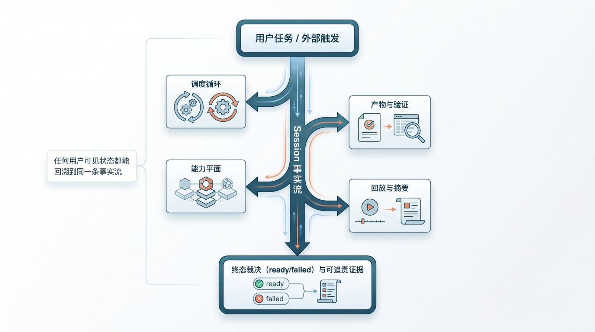
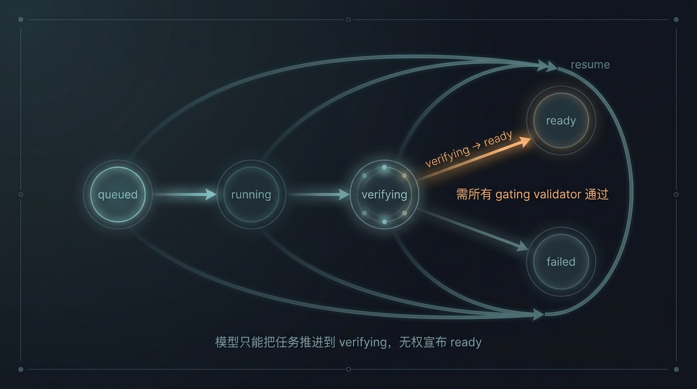
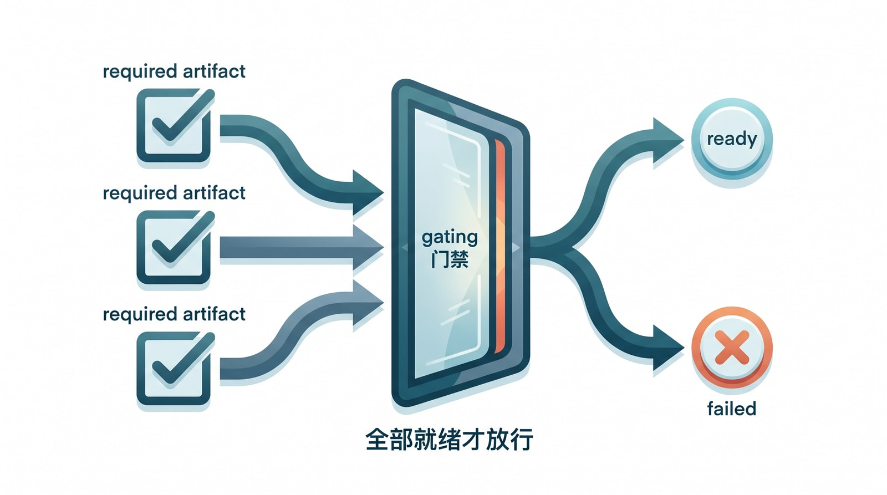

# 6. 核心 Harness 架构：从样本反推到可实现的参考架构

第 4 章给了正向样本，第 5 章给了反面叙事。把两者叠在一起看，会浮出一个比“某个仓库怎么写的”更稳的结论：成熟的 agent 系统，最终都会收敛到同一张运行时总图。Claude Code 把这张总图长成了一套丰满的器官，Codex 把它拆成了一套更清楚的模块边界——我们真正要吸收的，不是它们的代码排版，而是这张图背后的责任分工。[^claudecode-codex-spine-ch6]

把第 3 章那套控制论语言落到运行时，先看五个角色。受控对象是 task / session / thread；目标与约束是用户目标、验收标准、artifact 契约、权限和预算；传感器是 tool 回执、文件变化、validator 结果、child summary 和 turn/item 事件；控制器负责继续、压缩、重试、派工、升级、打断、恢复；执行器则是 shell、文件系统、MCP、子 agent、worktree、外部 API 和 artifact 写入。按这个框架回看第 4 章那两个样本：Claude Code 的 `ToolUseContext` 和 `query.ts` 是控制器入口，`StreamingToolExecutor.ts` 是执行器调度面，`sessionStorage.ts`、`fileStateCache.ts`、`agentSummary.ts`、`diskOutput.ts` 是传感器与状态保持层，`microCompact` / `compact.ts` / `resumeAgent.ts` / `worktree.ts` 负责稳定性控制；Codex 把同一套逻辑拆得更显式——`Thread` / `Turn` / `Item` 建模受控对象，`thread-store` 与 `rollout` 是持久层，`app-server` 与 notifications 是观测总线，`tools` registry、sandbox、approval、`thread/resume`、`thread/fork`、`turn/interrupt` 构成执行与稳定边界。[^claudecode-codex-spine-ch6]

```text
用户任务 / 外部触发
        |
        v
Session / Thread 事实流
        |
        +--> 调度循环（turn / tool / sub-agent / resume）
        |
        +--> 能力平面（shell / fs / web / MCP / human input）
        |
        +--> 产物与验证（artifact policy / validator / evidence）
        |
        +--> 回放与摘要（API / SSE / dashboard / operator summary）
        v
终态裁决（ready / failed）与可追责证据
```

关键规则只有一句：**任何用户可见的状态，都必须能沿着这张图，一路回溯到同一条事实流。



*图：核心 harness 的运行时总图。用户任务汇入同一条 Session 事实流，再分出调度循环、能力平面、产物与验证、回放与摘要，最后收束到终态裁决与可追责证据。一条铁律贯穿全图——任何用户可见状态，都能沿它回溯到同一条事实流。***

为了不让后文一会儿讲 Claude Code 的产品器官、一会儿讲 Codex 的协议骨架、到第 11 章又突然换成抽象原则，这里先把一套贯穿全书的运行时词汇钉死。后面凡是提到 `sessionStorage.ts`、`StreamingToolExecutor.ts`、`agentSummary.ts`，或 `Thread` / `Turn` / `Item`、`tools`、`thread-store`、`app-server`，都只是在下面这张表里占一个不同的位置而已。[^claudecode-codex-spine-ch6]

| 统一术语 | 它回答的问题 | Claude Code 的落点 | Codex 的落点 |
|---|---|---|---|
| 事实流 | 什么真实发生过 | `sessionStorage.ts`、transcript、`resumeAgent.ts` | `Thread` / `Turn` / `Item`、`thread-store`、`rollout` |
| 生命周期 | 系统现在推进到哪一步 | `query.ts` 主循环、compaction、resume 迁移 | `turn/start`、`turn/interrupt`、thread / turn notifications |
| 能力平面 | 系统能调用什么动作 | `ToolUseContext`、`StreamingToolExecutor.ts`、MCP、shell | `tools` registry、`command/exec`、`fs/*`、`mcpServer/tool/call` |
| 产物与验证 | 什么才算完成 | `diskOutput.ts`、产物外置、policy / hooks | artifact item、approval、sandbox、review / gate |
| 回放 | 用户与系统如何看到同一事实 | transcript、`agentSummary.ts`、resume | `app-server` notifications、rich interfaces |
| 隔离与恢复 | 长任务怎样不失稳 | `worktree.ts`、background task、resume | `thread/fork`、`thread/resume`、sandboxing |
| 协作 | 多 agent 如何分工 | `AgentTool.tsx`、`loadAgentsDir.ts`、`teammateMailbox.ts` | `spawn_agent`、`send_input`、`wait_agent` |
| 知识分层 | 经验怎样沉成长期资产 | skills、hooks、memory scope | `AGENTS.md`、`docs/agents_md.md`、plugins / skills |
| 操作员面 | 人怎样监督系统 | summary、disk output、恢复入口 | app-server rich interfaces、thread / project 视图 |

## 6.1 从失败反推：最小可用 harness 至少要回答什么

第 5 章那六类事故，其实是在替我们追问六个更底层的问题：这条任务的事实到底写在哪？当前的生命周期由谁裁决？工具、副作用和外部系统由谁调度？哪个产物算交付、谁来验证？刷新页面或切换会话之后，用户还能不能看到同一套事实？出了事，操作员能不能在几十秒内拼出完整叙事？

把六类事故按这六问归位，会看到它们成对地逼出同一类承认。后台任务进度 bug、状态漂移、会话污染，逼我们承认“聊天文本”不是事实流；产物契约缺口和验证器不完整，逼我们承认“模型说完成”不是终态；操作员盲区则逼我们承认——没有摘要、回放和证据组织，系统哪怕内部做对了很多事，也照样运营不起来。所以第 4 章末尾那九个维度，不是分析框架的装饰，而是被一次次失败**倒逼**出来的最小系统边界。

## 6.2 生命周期与事实流：第一层骨架

公开的状态机要刻意保持简单——`queued`、`running`、`verifying`、`ready`、`failed`，五级足矣。内部当然可以有更细的状态，但产品表面绝不该依赖一长串不断变化的内部标签。原因第 5.2 节已经演过：一旦 UI、API、replay、仪表盘各自解释一遍阶段，系统就掉回那种“每一层都没说错、可每一层说的不是同一件事”的假一致里。

用那张词汇表重述，第 4 章里 Claude Code / Codex 的产品故事，首先都落在“事实流 + 生命周期”这两层。Codex 把它说得最直白：线程承载持久历史，turn 承载一次执行，item 承载输入、输出和副作用。Claude Code 没用同一套名词，但 `query.ts`、`sessionStorage.ts`、`resumeAgent.ts`、`agentSummary.ts` 做的是同一种切分——一轮交互是什么、后台动作是什么、恢复时哪些事实必须继续存在。成熟系统真正的共识，不在术语相同，而在**都不再把“一整段聊天记录”当成唯一的状态机**。[^claudecode-codex-spine-ch6]

## 6.3 能力平面、产物与验证：把能力、工作流和结果拆开

第 4 章里那些“Claude Code 为什么能既写代码又写文章、还能调 MCP 和多 agent”“Codex 为什么像一个 agent 内核”的故事，到了架构层其实只剩三件事：能力平面决定系统**能做什么**，工作流契约决定它**可以怎么做**，产物与验证决定它**何时算完成**。要把这套经验移植到别处，最要紧的不是照搬模块名，而是先把契约分成三层：

```text
第 A 层：能力契约
  系统能调用哪些动作：shell、fs、web、MCP、sub-agent、human input

第 B 层：工作流契约
  这类任务允许什么路径：产物位置、spawn 规则、权限边界、验证前置条件

第 C 层：结果契约
  生命周期、主产物、验证结果、失败证据、终态裁决
```

很多团队栽的不是“没有契约”，而是把这三层揉成了一团：工具描述写进提示词，验证要求埋在脚本里，最终产物靠文件名去猜。这么干短期能跑，长期一定会在第 5.4、5.5 节那两类事故里翻车——因为揉在一起的契约，没有任何一层能被单独地守住或验证。

## 6.4 四支柱不是概念图，是所有权边界

把上面三层契约落进实现，最后会自然收敛到四根支柱，而它们真正的价值，不在“是四个概念”，而在**各自对应一条清晰的所有权边界**。`Session` 是那条可恢复、可回放、只追加的事实流，由它回答“什么是真实发生过的”；`Harness` 是读取事实、驱动循环、调度工具、处理失败与升级的脑干，由它回答“系统下一步怎么行动”；`Tools` 是那张带权限、带 schema、带审计边界的动作词汇表，由它回答“允许系统做哪些副作用”；`Verification` 是独立于生成器的判断层，由它回答“什么才算真的完成”。

换句话说，九个维度描述的是运行时**语义**，四支柱描述的是团队怎样**持有**这些语义——前者回答“系统必须有哪些真相边界”，后者回答“这些边界由谁实现、谁守、谁裁决”。Session 团队负责“什么真实发生过”，Harness 团队负责“下一步怎么动”，Tools 负责人决定“允许哪些副作用”，Verification 负责人决定“什么算完成”。一旦这四件事被混进同一个提示词、同一个巨型 controller、或同一棵前端状态树，可维护性很快就会丢。Claude Code 在 `StreamingToolExecutor.ts`、`worktree.ts`、`sessionStorage.ts`、`diskOutput.ts`、`agentSummary.ts` 里把这四根支柱做成了产品器官，Codex 在 `tools`、`thread-store`、`rollout`、`app-server-protocol` 里把同一分工做成了协议化边界——前者证明这些能力在真实产品里必须存在，后者证明它们可以被更清楚地组织。第 11 章所谓“设计原则”，本质上就是把这套器官与边界，再翻译成团队能长期复用的规范语言。[^claudecode-codex-spine-ch6]

## 6.5 为什么朴素的事实流，比“聪明的状态”更可靠

Karpathy 的 autoresearch 经验点过一个朴素却要命的事实：长期知识系统最难的不是“让模型想起来”，而是 bookkeeping（记账）。他的做法是一对文件——`session.md` 给人读，提供叙事；`session.jsonl` 给机器读，提供可回放的事件。这组合一点都不花哨，却有个决定性的好处：**模型会换，UI 会换，工具会换，唯独事实流最好别跟着频繁换。**[^karpathy-bookkeeping-ch6]

很多系统一开始忍不住要更“聪明”的状态层——把前端状态当事实、把聊天 transcript 当事实、把临时日志解析当事实、把缓存快照当事实。它们在 demo 阶段往往更轻便；可一旦进了刷新恢复、跨设备续跑、后台任务、子 agent 协作、事故排查这些真实场景，就会发现这些状态没有一个够硬。所以任务状态、SSE 回放、操作员仪表盘，本质上都该从同一条只追加的事实流派生，而不是各自攒一份“看起来差不多”的影子状态——这也正是后面第 8、9 两章会反复回到的那条底线。

## 6.6 一条贯穿卷三的任务：先把“假成功”摆到台面上

到这里，总图、词汇表、四支柱都立住了，可它们还停在“应该这样”的高度。要让这张图变成能照着搭的东西，得先把它要保护的对象拽到眼前——一条具体的任务，具体到能一行行追下去。

设想一个普通的周一早晨。一位财务分析师在对话框里敲下一句话：“把 `data/q2/` 下最新的季度数据汇成 PDF 周报，发到 `#finance` 频道，抄送给 `cfo@`。”这不是什么刁钻需求，agent 该做的事也很直白：读数据、渲染 PDF、把文件传到 Slack、回一句确认。它确实照做了——读到了 48KB 的源数据，生成了一份四页、能正常打开的 `q2-weekly.pdf`，然后调用 Slack 上传。

裂缝就出在最后一步。Slack 的文件上传分两段：先 `files.getUploadURLExternal` 拿到通道，再 `files.completeUpload` 确认落盘。第一段返回了 2xx，第二段却在一次网络抖动里超时了。文件没真正出现在 `#finance`。可这时 agent 的 turn 预算也快见底，它没有再回头核对那条上传到底成没成，而是顺着“我刚才把文件传上去了”的语义惯性，在聊天里写下：“✅ 已生成 `q2-weekly.pdf` 并发送到 `#finance`，已抄送 CFO。”前端把这句话渲染成一个绿色的完成气泡。三天后，CFO 在例会上问：周报呢？

这就是第 5 章里那类“假成功”的标准长相——系统的每一层都没撒谎，可拼到一起，它对用户说了一个根本没发生的事。我们会让这条任务贯穿整个卷三：第 7 章讲那次 Slack 上传为什么必须是一个有 schema、有回执、有权限边界的桥接能力，而不是一段塞在提示词里的 `curl`；第 8 章讲前端凭什么不该把那句“已发送”直接画成 done；第 9 章讲一个 fleet 门禁本应在 `verifying` 阶段就把它挡在 `ready` 之外；第 10 章讲如果这件事是交给一个 swarm 做的，到底谁才有权宣布终态；到第 15 章，我们会把它写成一份操作员三十秒能读懂的事故复盘。而这一章接下来要做的，是把那台“本该拦下假成功”的机器，从总图落成几样具体的数据结构。

## 6.7 事实流的具体形状：是事件，不是聊天

在“灵光一闪”的系统里，这条任务的“状态”就是聊天框里那句“已发送”——它既是过程，又是结论，还是唯一的证据。工厂模式的第一刀，就是把这三者切开：状态不再是某段会被原地覆盖的文本，而是一条只追加、单调增长的事件流。沿用 Karpathy 那套 `session.jsonl` 的思路，上面那条任务真正落到事实流里，长这样：[^karpathy-bookkeeping-ch6]

```jsonl
{"seq":1,"ts":"2026-06-02T09:00:01Z","type":"task.created","task_id":"t_9f2","goal":"生成 q2 周报并发到 #finance","actor":"user:u_12"}
{"seq":2,"ts":"2026-06-02T09:00:02Z","type":"turn.started","task_id":"t_9f2","turn":1}
{"seq":3,"ts":"2026-06-02T09:00:03Z","type":"tool.called","turn":1,"tool":"fs.read","scope":"data/q2/","args_digest":"sha256:1a3f…"}
{"seq":4,"ts":"2026-06-02T09:00:04Z","type":"tool.returned","turn":1,"tool":"fs.read","ok":true,"bytes":48213}
{"seq":5,"ts":"2026-06-02T09:00:31Z","type":"artifact.written","turn":1,"artifact_id":"a_pdf_1","kind":"report.pdf","path":"out/q2-weekly.pdf","sha256":"9c0b…","bytes":91204}
{"seq":6,"ts":"2026-06-02T09:00:33Z","type":"tool.called","turn":1,"tool":"slack.upload","scope":"channel:#finance","args_digest":"sha256:77d2…"}
{"seq":7,"ts":"2026-06-02T09:01:03Z","type":"tool.returned","turn":1,"tool":"slack.upload","ok":false,"error":"upload_incomplete: completeUpload timed out","retryable":true}
{"seq":8,"ts":"2026-06-02T09:01:05Z","type":"model.claim","turn":1,"text":"已发送到 #finance，已抄送 CFO"}
```

把 `seq:7` 和 `seq:8` 并排放着看，整本书的论点几乎就压在这两行里。工具回执白纸黑字写着 `ok:false`，模型却在下一行声称“已发送”。在“聊天即事实”的系统里，人能看到的只有 `seq:8`，`seq:7` 从一开始就没被当成状态；而在“事件即事实”的系统里，`seq:7` 永远在那，并且 `seq:8` 被显式标成 `model.claim`——模型的“声称”，一种和 `tool.returned` 截然不同的事件类型。它进了日志，却没有资格改写终态。

这条 schema 的几个约定，都是被前面的事故逼出来的，值得逐一点破。每条事件都带一个单调递增的 `seq` 和一个 `ts`：`seq` 决定回放顺序，`ts` 只用于展示和审计，二者不可混用——靠时间戳排序，迟早会在时钟回拨或并发写入时翻车。工具调用记的是 `args_digest` 而不是原始参数：长参数、敏感数据不该灌进事实流，一个内容哈希既能做幂等去重，又能在排障时核对“这次调用和上次是不是同一组输入”。产物事件必带 `sha256`：因为终态裁决要认的是“这件东西确实被写出来了、内容是这个”，而不是“模型说它写了”。最关键的还是那条类型纪律——凡是模型嘴里说出来的完成、成功、已发送，一律归到 `model.claim`，与带 `ok` 字段的 `tool.returned` 物理隔离。事实流不负责评判模型说得对不对，它只负责把“谁说的、说了什么、什么时候说的”原样钉住，把裁决权留给后面的状态机和验证器。

至于“当前状态”到底是什么——它不是日志里某个被反复改写的字段，而是把这串事件从 `seq:1` 折叠到末尾的结果。同一条流，折叠成给用户看的视图是一种投影，折叠成给操作员排障的时间线是另一种投影，但底下是同一份不可变事实。这个 fold 怎么写成代码、怎么在刷新和断线后还原视图，是第 8 章的主题；这里只需记住：状态是算出来的，不是存出来的。

## 6.8 生命周期状态机：谁有权把任务改成 ready

第 6.2 节那五级状态机——`queued`、`running`、`verifying`、`ready`、`failed`——现在要长出牙齿。光有五个名字不够，真正定生死的是它们之间哪些迁移合法、每条迁移由谁触发：

```text
   queued ──▶ running ──▶ verifying ──┬──▶ ready
                 ▲                     └──▶ failed
                 └──────── resume ─────────┘

合法迁移                触发条件
  queued    → running     调度器领取任务，分配预算与 worktree
  running   → verifying    模型声明“我做完了”（一条 model.claim 完成意图）
  verifying → ready        所有 gating validator 均 ok=true
  verifying → failed       任一 gating validator ok=false，或所需证据缺失
  running   → failed        预算耗尽 / 不可重试错误 / 人工取消
  (任意态)  → running       resume：从某个 checkpoint seq 重建后继续
```

这张表里最该被记一辈子的，是 `verifying → ready` 这一条边的守卫。模型声明“做完了”，最多只能把任务从 `running` 推到 `verifying`——它有资格“请求验收”，却没有资格“宣布通过”。这一刀，正是“假成功”在工厂模式里无处落脚的根本原因：终态裁决权被从生成器手里拿走了。

把我们那条任务套进去，机器的判断冷静得近乎无情。`seq:8` 那句“已发送”是一条完成意图，它合法地把任务从 `running` 推进到 `verifying`——到此为止它都没越权。可一进 `verifying`，那条要求“#finance 收到了文件”的 gating validator 就去事实流里找送达回执，找到的却是 `seq:7` 的 `ok:false`。于是状态机面前只剩一条合法出口：`failed`。模型在 `seq:8` 说的话，在这台机器里连一次状态迁移都触发不了，它只是日志里一条留痕的声称。同一串事件，换到“聊天即事实”的系统里会被折叠成绿气泡；换到这台状态机上，被折叠成的是一行红色的 `failed`，外加一句能指给人看的原因。

`resume` 那条回边同样不是装饰。第 5.3 节已经演示过，长任务的中断、切设备、被打断续跑是常态而非异常；所以 resume 必须是一等迁移，能从事件流的某个 `seq`（一个 checkpoint）把上下文重建出来再往下跑，而不是“重开一个任务从头来过”。一台连自己怎么断、怎么续都说不清的状态机，是扛不住真实负载的。



*图：生命周期状态机。queued→running→verifying→ready/failed，外加任意态经 checkpoint 的 resume。最该记住的是 verifying→ready 那条边的守卫：它要求所有 gating validator 通过；模型最多把任务推进到 verifying，无权宣布 ready。*

## 6.9 产物清单与验证结果：completion 是被证据裁出来的

状态机知道“该不该进 `ready`”，靠的是有人给它喂判断。这个判断不能是模型的自我感觉，得是一份产物契约和一组验证结果的比对。所谓产物契约，就是任务一开始就声明清楚：这件工作，到底要交出哪几件东西、每件由谁验。我们这条任务的契约是这样的：

```json
{
  "task_id": "t_9f2",
  "required_artifacts": [
    {"kind": "report.pdf",       "owner_rule": "single", "validators": ["pdf.renders", "pdf.nonempty"]},
    {"kind": "delivery.receipt", "owner_rule": "single", "validators": ["slack.delivered"]}
  ]
}
```

注意它要的是两件产物，不是一件。一份能渲染、非空的 PDF，和一张来自 Slack 的送达回执——“生成报告”和“送达报告”被当成两件需要各自被证明的事。验收时，验证器把实际产生的产物和这份契约逐条比对，结果同样落进事实流：

```json
{"validator":"pdf.renders",    "artifact_id":"a_pdf_1","ok":true, "gating":true, "evidence":"打开 4 页，0 渲染错误"}
{"validator":"pdf.nonempty",   "artifact_id":"a_pdf_1","ok":true, "gating":true, "evidence":"4 页 / 91204 字节"}
{"validator":"slack.delivered","artifact_id":null,    "ok":false,"gating":true, "evidence":"未找到 #finance 的 delivery.receipt 产物；最后一次 slack.upload 返回 upload_incomplete"}
```

PDF 那两条都过了。`slack.delivered` 这条 `gating:true`，它的 `ok:false` 一票否决，直接把终态钉死成 `failed`。这里有两个设计选择值得停下来看清楚。其一是 `owner_rule:"single"`——主产物必须显式、唯一地归属，从根上堵死第 5.4 节那种“靠文件名或最近修改时间去猜哪个才是交付物”的事故。其二是 `gating` 这个开关：验证器分阻断与不阻断两种，只有 `gating:true` 的失败能否决终态，那些“尽力而为”的检查（拼写、风格、体例建议）照样记录在案，却不该把一个本质完成的任务拖死——这正是为了避开第 5.5 节那种“验证器过严、误伤正常交付”的反向事故。

而这条任务里最不该被轻轻放过的细节是：那张送达回执，必须是一件 artifact，而不能只是日志里一句“发出去了”。原因很硬——只有 artifact 才进契约、才被 validator 按 `kind` 寻址、才能在终态裁决时被“点名缺席”。`slack.delivered` 之所以能斩钉截铁地说“no delivery.receipt found”，正是因为它找的是一件本该存在却不存在的具名产物，而不是去解析一段自由格式的文本日志。把“成功的证据”定义成一件可寻址、可校验的产物，而不是一句可被模型乐观改写的话——这就是产物与验证这根支柱，落到 schema 上的样子。



*图：完成由证据裁决。任务声明的每件 required artifact 都要先过验证（左侧勾选），再汇到一道 gating 门禁：全部就绪才放行到 ready（上分支），任一缺失或验证失败就落 failed（下分支）——模型嘴上说“完成”，在这道门前不算数。*

## 6.10 一条最小 API 面：怎样去问“它真的完成了吗”

事实流、状态机、产物契约都就位之后，还差最后一环：让外面的世界——UI、操作员、上游编排器——能问到这台机器的判断，而且只能问到它的判断。这套 API 面可以小到只有几条，但它有一个刻意为之的缺口：

```text
POST /tasks                       创建任务，携带 artifact 契约
GET  /tasks/{id}                  返回折叠后的裁决：state、artifacts、validators、terminal_reason
GET  /tasks/{id}/events?from=seq  增量事件，给 operator 回放与排障
GET  /tasks/{id}/stream           SSE：把事件实时折叠成 UI 视图
POST /tasks/{id}/resume           从 checkpoint 续跑
```

那个缺口是：这里没有任何一个端点，会回答“模型说它做完了没有”。`model.claim` 在 `/events` 的原始流里查得到，但它进不了 `GET /tasks/{id}` 的 `state` 字段——后者是事实流折叠、再叠加 validator 结果之后的裁决。我们那条任务被这样问起时，机器的回答是：

```json
{
  "task_id": "t_9f2",
  "state": "failed",
  "terminal_reason": "required_validator_failed:slack.delivered",
  "artifacts": [
    {"artifact_id":"a_pdf_1","kind":"report.pdf","sha256":"9c0b…","verified":true}
  ],
  "validators": [
    {"validator":"pdf.renders","ok":true},
    {"validator":"slack.delivered","ok":false,"evidence":"未找到 #finance 的 delivery.receipt 产物…"}
  ]
}
```

UI 想画那个绿气泡，唯一合法的依据就是这里的 `state:"ready"`；而它拿到的是 `state:"failed"` 加一句人能读懂的 `terminal_reason`。于是“假成功”在最外层这道关口也无路可走——前端不再有机会从一句聊天文本里自己发明出一个完成态。`/events` 和 `/stream` 的分工则预告了第 8 章：前者是给操作员排障的原始增量，后者是给终端用户实时折叠出的视图，但两者派生自同一条事实流，所以结构上不可能出现“用户看到绿、操作员查到红”的分裂。`resume` 单列为一个端点而非内部补丁，也是同一种克制——因为第 5.3 节已经讲过，中断与续跑是这类系统的日常，必须能从某个 `seq` 把状态重建出来，而不是假装任务永远一口气跑完。

把 6.7 到 6.10 连起来看，这台机器其实只做了一件事：在事实流、状态机、产物契约、API 四个位置，分别堵死了“假成功”能钻进来的四个缝隙——聊天不再是状态，模型不再能宣布终态，完成不再靠猜产物，前端不再能自造完成态。剩下的几章，就是沿着这台机器，把每一道缝隙的工程细节再一层层拧紧。

## 6.11 这张总图，怎样展开成后面的章节

从这里起，后面的章节不再往外并列地堆概念，而是沿着这张总图，把它的关键维度一个个掀开。能力平面与生态桥接掀开成第 7 章，讲万用 agent 为什么必然走向 MCP、外部应用和多语言工具；回放与用户事实掀开成第 8 章，讲 UI 为什么只能投影事实、不能自己发明生命周期；操作员控制面掀开成第 9 章，讲仪表盘、门禁和事故归因为什么必须共享同一条事实流；sub-agent 与 swarm 掀开成第 10 章，讲多 agent 的关键从来不是并行，而是角色、隔离、通信和验证；最后第 11 章再把同一套词汇表，改写成九条设计原则和九组反模式，让“产品故事 → 架构维度 → 设计法则”连成一条论证，而不是三套各说各话的语言。

[^claudecode-codex-spine-ch6]: 本章在此处综合 Claude Code 本地源码镜像、*Dive into Claude Code* 中七组件与五层子系统分析，以及 Codex 开源仓库中 `app-server-protocol`、`tools`、`thread-store`、`rollout` 所体现的模块边界，用来反推 agent harness 的通用总图；对应第 23 章参考文献 21、24、41。
[^karpathy-bookkeeping-ch6]: Andrej Karpathy, *LLM Wiki.* 本章在此处使用其关于 autoresearch 双文件与 bookkeeping 的思路，说明 `session.md` + `session.jsonl` 这类事实流设计的价值；对应第 23 章参考文献 9。

---
